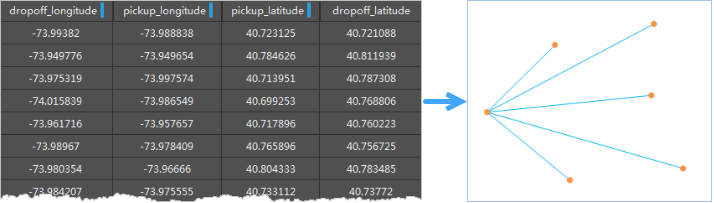

OD线(Origin-Destination
Line)是起点和终点的连线，通常用于表示两点之间的某种关系，如航班线路、人口迁徙、交通流量、资金交易流向等。“O”表示出发点Origin，“D”表示目的地Destination，OD线构造分析就是根据OD的起始位置和终止位置，构造出来对应的OD线。

OD分析构造用于计算属性表数据中起点和终点间的通行量，并统计同一条线路中的属性信息（如出行人数等）。

###  应用场景

OD线构造分析可用于以下场景：

  * 可以确定公交线网上的乘客分布规律，为公交线网优化提供数据。
  * 通过个人出行调查获得数据，为城市综合交通体系规划与评价提供基础数据。
  * 货流OD调查可以为分析、预测货物发生（即各交通区的货运人、运出量），分布（即各交通区之间及交通区与外地之间的货物来往量）提供必要的基础数据。

###  操作说明

  1. 在“在线”选项卡的“分析”组中，选择“OD线构造分析”，即可弹出 **OD线构造分析** 的参数设置对话框。
  2. **iServer服务地址** ：登录iServer帐号，具体操作请参见[数据输入](DataInputType.html)页面。
  3. **分析参数设置** ：
    * **行政区面数据集** ：必填参数，指定待分析数据集 。
    * **OD表数据集** ：必填参数。OD表数据集。（仅支持属性表类型）。
    * **行政区名称字段** ：必填参数。指用来区别不同行政区面。
    * **坐标字段数组** ：必填参数。用来定义起始点和终止点坐标，单击下拉按钮，依次选择起始点X字段、起始点Y字段、终止点X字段、终止点Y字段，中间会自动用逗号隔开。
    * **属性统计字段** ：选填参数。仅支持系统字段以外的整形、长整形、浮点型的字段的名称。
    * **属性统计模式** ：选填参数。支持统计类型有最大值、最小值、平均值、记录集个数、总和、方差、标准差。
  4. 设置好以上参数之后，单击“ **执行** ”按钮，分析执行完成之后，分析结果会在地图窗口打开，分析结果的存储路径也会在输出窗口中提示。 **注意** ：用户若直接打开生成结果路径的数据会提示打开失败，是由于基于iSever服务的分析，会存在数据被占用而无法打开的情况。建议用户将数据拷贝至其他路径中打开该数据进行编辑操作。

下图为全球航班线OD分析结果图：

###  相关主题

[环境配置](BigDataAnalysisEnvironmentConfiguration.html)

 [数据准备](DataPreparation.html)

