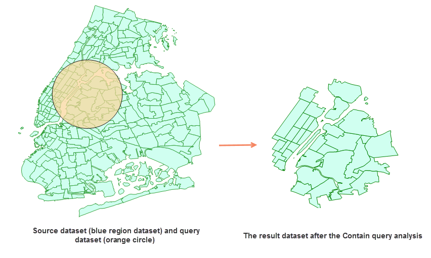

---
id: SingleObjectSpatialQuery
title: 单对象空间查询
---  

空间查询是通过几何对象之间的空间位置关系来构建过滤条件的一种查询方式。例如：通过空间查询可以找到被包含在面中的空间对象，相离或者相邻的空间对象等。

应用程序目前支持 8 种空间查询位置关系，包括：相交、包含、交叉、分离、重合、相交、叠加、邻接、被包含。有关空间查询关系的详细说明请参考[空间查询算子](../Query/SQ_BasicOperators.htm)页面。

在线分析中的单对象空间查询，只支持查询对象数据集中有一个对象对被查询数据集做空间查询。如果查询对象数据集中有多个对象，则默认用 SmID
最小的对象对被查询数据集做空间查询。

###  操作说明

1. 在“在线”选项卡的“分析”组中，选择“单对象空间查询”，即可弹出 **单对象空间查询** 的参数设置对话框。
2. **源数据集** ：必填参数，指定待查询数据集。通过确定“输入方式”选择用于进行裁剪分析的矢量数据集，单击下拉按钮选择即可，下拉选项中会自动过滤符合分析要求的源数据集，详细说明请参见[数据输入](DataInputType.html)页面。
3. **iServer服务地址** ：通过下拉选项登录iServer服务地址和帐号，详细说明请参见[数据输入](DataInputType.html)页面。
4. **查询数据** ：必填参数，指查询对象所在的数据集。只支持单一对象查询。如果数据集中包含多个对象，则默认用 SmID 最小的对象对被查询数据集做空间查询。 
5. **分析参数** ：需要设置 **空间查询模式** 。不同的空间查询模式对源数据集和查询对象数据集的类型有不同要求。  

* 重合、分离、包含、相交、邻接、被包含：要求源数据集和查询对象数据集类型为点、线、面均可。
* 交叉：要求源数据集类型必须为线；查询对象数据集类型必须为 线 或 面。
* 叠加：要求源数据集类型和查询对象数据集类型必须均为 线/线 或 面/面。
6. 设置好以上参数之后即可进行单对象空间查询，分析成功之后，地图窗口会自动打开分析结果，同时输出窗口会提示结果数据集所保存在的工作空间路径，可从该路径获取结果数据集。 **注意** ：用户若直接打开生成结果路径的数据会提示打开失败，是由于基于iSever服务的分析，会存在数据被占用而无法打开的情况。建议用户将数据拷贝至其他路径中打开该数据进行编辑操作。

###  相关主题

 [环境配置](BigDataAnalysisEnvironmentConfiguration.html)

 [数据准备](DataPreparation.html)

