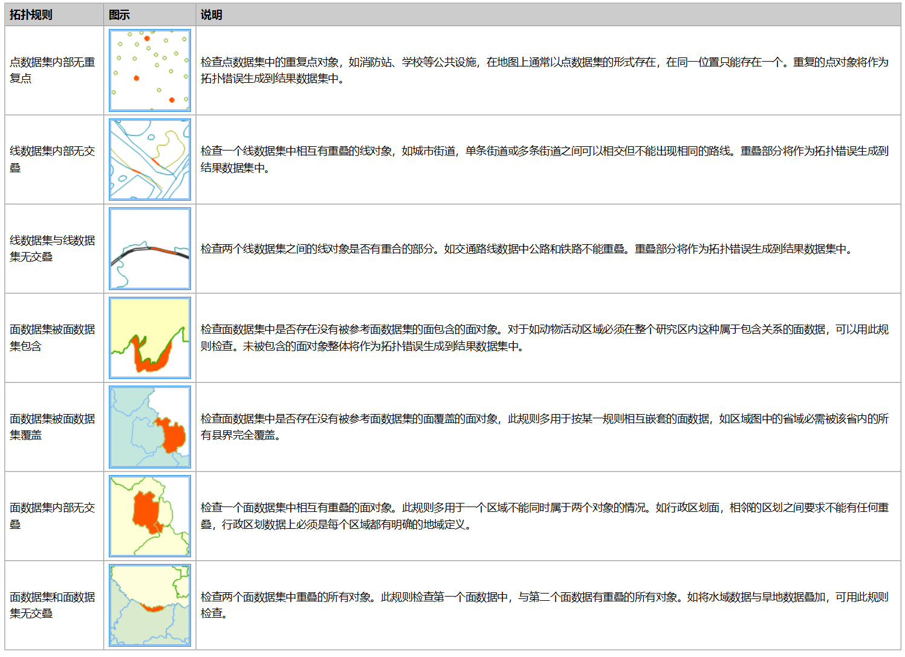

拓扑检查，指的是根据相应的拓扑规则对点、线和面数据进行检查，返回不符合规则的对象的一种操作作业。SuperMap
支持的以下7种拓扑规则：面数据集内部无交叠、面数据集和面数据集无交叠、面数据集被面数据集包含、面数据集被面数据集覆盖、线数据集内部无交叠、线数据集与线数据集无交叠、点数据集内部无重复点。下面对其中的三种做简单的说明。

  
  
###  功能入口

* **在线** 选项卡-> **分析** 组-> **拓扑检查** 。

###  操作说明

1. **iServer服务地址** ：通过下拉选项登录iServer服务地址和帐号，详细说明请参见[数据输入](DataInputType)页面。
2. **源数据集** ：设置需进行拓扑检查的数据集，此处显示的数据集类型与拓扑检查规则有关，单击下拉按钮选择即可，下拉选项中会自动过滤符合分析要求的源数据集，详细说明请参见[数据输入](DataInputType)页面。
3. **分析参数设置** ： 
    * **拓扑检查规则** ：必填参数，单击下拉按钮选择一种拓扑规则。
    * **拓扑检查数据集** ：拓扑检查规则为面数据集和面数据集无交叠、面数据集被面数据集覆盖、面数据集被面数据集包含、线数据集与线数据集无交叠为时，该参数为必填参数，需要选择一个数据集与源数据进行拓扑检查。
    * **容限** ：选填参数，设置拓扑错误检查时使用的容限，单位与进行拓扑错误检查的数据集单位相同，取值范围为≥0，默认值：0.000001。
4. 设置好以上参数即可进行拓扑检查，分析成功之后，地图窗口会自动弹出分析结果，同时输出窗口会提示结果数据集所保存在的工作空间路径，可从该路径获取结果数据路径。 **注意** ：用户若直接打开生成结果路径的数据会提示打开失败，是由于基于iSever服务的分析，会存在数据被占用而无法打开的情况。建议用户将数据拷贝至其他路径中打开该数据进行编辑操作。

###  相关主题

 [环境配置](BigDataAnalysisEnvironmentConfiguration)

 [数据准备](DataPreparation)