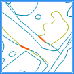
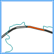
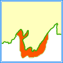
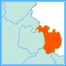
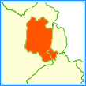
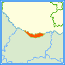

拓扑检查，指的是根据相应的拓扑规则对点、线和面数据进行检查，返回不符合规则的对象的一种操作作业。SuperMap
支持的以下7种拓扑规则：面数据集内部无交叠、面数据集和面数据集无交叠、面数据集被面数据集包含、面数据集被面数据集覆盖、线数据集内部无交叠、线数据集与线数据集无交叠、点数据集内部无重复点。下面对其中的三种做简单的说明。

拓扑规则 | 图示 | 说明  
---|---|---  
点数据集内部无重复点 |  |
检查点数据集中的重复点对象，如消防站、学校等公共设施，在地图上通常以点数据集的形式存在，在同一位置只能存在一个。重复的点对象将作为拓扑错误生成到结果数据集中。  
线数据集内部无交叠 |  |
检查一个线数据集中相互有重叠的线对象，如城市街道，单条街道或多条街道之间可以相交但不能出现相同的路线。重叠部分将作为拓扑错误生成到结果数据集中。  
线数据集与线数据集无交叠 |  |
检查两个线数据集之间的线对象是否有重合的部分。如交通路线数据中公路和铁路不能重叠。重叠部分将作为拓扑错误生成到结果数据集中。  
面数据集被面数据集包含 |  |
检查面数据集中是否存在没有被参考面数据集的面包含的面对象。对于如动物活动区域必须在整个研究区内这种属于包含关系的面数据，可以用此规则检查。未被包含的面对象整体将作为拓扑错误生成到结果数据集中。  
面数据集被面数据集覆盖 |  |
检查面数据集中是否存在没有被参考面数据集的面覆盖的面对象，此规则多用于按某一规则相互嵌套的面数据，如区域图中的省域必需被该省内的所有县界完全覆盖。  
面数据集内部无交叠 |  |
检查一个面数据集中相互有重叠的面对象。此规则多用于一个区域不能同时属于两个对象的情况。如行政区划面，相邻的区划之间要求不能有任何重叠，行政区划数据上必须是每个区域都有明确的地域定义。  
面数据集和面数据集无交叠 |  |
检查两个面数据集中重叠的所有对象。此规则检查第一个面数据中，与第二个面数据有重叠的所有对象。如将水域数据与旱地数据叠加，可用此规则检查。  
  
###  操作说明

  1. 在“在线”选项卡的“分析”组中，选择“拓扑检查”，即可弹出 **拓扑检查** 的参数设置对话框。
  2. **iServer服务地址** ：通过下拉选项登录iServer服务地址和帐号，详细说明请参见[数据输入](DataInputType.html)页面。
  3. **源数据集** ：设置需进行拓扑检查的数据集，此处显示的数据集类型与拓扑检查规则有关，单击下拉按钮选择即可，下拉选项中会自动过滤符合分析要求的源数据集，详细说明请参见[数据输入](DataInputType.html)页面。
  4. **分析参数设置** ： 
    * **拓扑检查规则** ：必填参数，单击下拉按钮选择一种拓扑规则。
    * **拓扑检查数据集** ：拓扑检查规则为面数据集和面数据集无交叠、面数据集被面数据集覆盖、面数据集被面数据集包含、线数据集与线数据集无交叠为时，该参数为必填参数，需要选择一个数据集与源数据进行拓扑检查。
    * **容限** ：选填参数，设置拓扑错误检查时使用的容限，单位与进行拓扑错误检查的数据集单位相同，取值范围为≥0，默认值：0.000001。
  5. 设置好以上参数即可进行拓扑检查，分析成功之后，地图窗口会自动弹出分析结果，同时输出窗口会提示结果数据集所保存在的工作空间路径，可从该路径获取结果数据路径。 **注意** ：用户若直接打开生成结果路径的数据会提示打开失败，是由于基于iSever服务的分析，会存在数据被占用而无法打开的情况。建议用户将数据拷贝至其他路径中打开该数据进行编辑操作。

###  相关主题

[环境配置](BigDataAnalysisEnvironmentConfiguration.html)

 [数据准备](DataPreparation.html)

