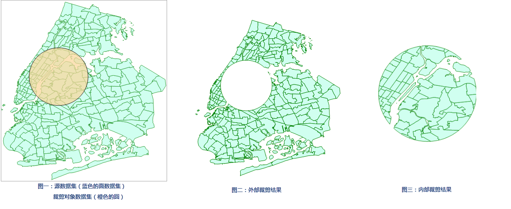

矢量裁剪为对矢量数据集进行裁剪。包括内部裁剪和外部裁剪。
内部裁剪，则被裁剪的矢量数据集在裁剪区范围内的部分被保留到结果数据集中；相反，使用外部裁剪，则保留不在裁剪区范围内的那部分数据到结果数据集中。

分布式分析服务中的矢量裁剪，只支持裁剪对象数据集中有一个对象对源数据集做矢量裁剪。如果裁剪数据集中有多个对象，则默认用 SmID 最小的对象对源数据集做矢量裁剪。

###  功能入口

  * **在线** 选项卡-> **分析** 组-> **矢量裁剪** 。

###  操作说明

1. **iServer服务地址** ：通过下拉选项登录iServer服务地址和帐号，详细说明请参见[数据输入](DataInputType)页面。
2. **源数据** ：必填参数，指定待裁剪数据集。通过确定“输入方式”选择用于进行裁剪分析的矢量数据集，单击下拉按钮选择即可，下拉选项中会自动过滤符合分析要求的源数据集，详细说明请参见[数据输入](DataInputType)页面。
3. **分析参数设置** ：
  * **裁剪对象数据集** ：必填参数，指定作为裁剪范围的数据集。数据输入方式同“源数据”设置。  

  * **裁剪分析模式** ：需要设置裁剪分析模式，内部裁剪或外部裁剪。  

4. 设置好以上参数之后，即可进行矢量裁剪分析，分析成功之后，地图窗口会自动输出分析结果，同时输出窗口会提示结果数据集所保存在的工作空间路径，可从该路径获取结果数据集。 **注意** ：用户若直接打开生成结果路径的数据会提示打开失败，是由于基于iSever服务的分析，会存在数据被占用而无法打开的情况。建议用户将数据拷贝至其他路径中打开该数据进行编辑操作。

###  相关主题

 [环境配置](BigDataAnalysisEnvironmentConfiguration)

 [数据准备](DataPreparation)
