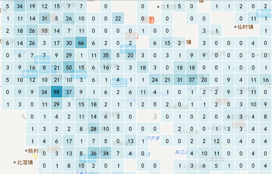

---
id: GridAggregationMap
title: 网格聚合图
---  

### 使用说明

网格聚合图简单说就是一种使用空间聚合方法，表现空间数据的分布特征和统计特征。它的基本原理是基于网格聚合算法，将空间区域划分为规则形状的网格单元，每个网格单元又划分为多个层次，高层次的网格单元被分为多个低层次的网格单元，每个网格单元都具有统计信息。

SuperMap支持对空间点数据构建网格聚合图，并且提供了两种形状的网格进行聚合显示，一种是矩形网格，一种是六边形网格。通过网格对地图点要素进行网格划分，然后，计算每个网格单元内点要素的数量，并作为网格的统计值，也可以引入点的权重信息，考虑网格单元内点的加权值作为网格的统计值；最后基于网格单元的统计值，按照统计值大小排序的结果，通过色带对网格单元进行色彩填充。

一幅完整的网格聚合图包含以下几个要素：

* **网格** ：每个网格单元为一致大小的格网，可以为四边形或者六边形，并且地图比例尺的变化，网格单元的大小固定不变；网格用来统计落入每个网格单元内的点对象数目。
* **标签** ：每个网格中心具有一个标签，该标签为网格单元的统计值，该统计值可以是落入每个网格单元内的点对象数目，也可以是落入每个网格单元内的点的加权值。
* **网格渲染风格** ：网格单元的填充颜色表示网格统计值的分布趋势，其颜色由深到浅，表示网格单元的值从大到小。另外，还可以设置网格矩形边框的风格。

### 操作步骤

1. 在图层管理器中选中要制作网格聚合图的点数据图层，然后单击“专题图”选项卡，选择“聚合图”中的“网格聚合图”，制作一幅网格聚合图。
2. 创建完成的网格聚合图将自动添加到当前地图窗口中作为一个专题图层显示，同时在图层管理器中也会相应地增加一个专题图层。 
3. 在图层管理器中选中网格聚合图图层，右键单击“修改专题图”命令，在弹出的“图层属性”窗口中显示了当前网格聚合图的设置信息。
4. 在“图层属性”窗口。可以通过一些设置参数调整网格聚合图的显示效果，参数设置包含了网格聚合图层的显示控制、重新指定数据集等基本属性设置。
* **显示控制设置** ：分别对图层可见性、图层名称、图层标题、透明度及最大、最小可见比例尺进行设置。
  * **可见性** ：在图层属性面板中，可统一设置图层分组中所有图层的可见性。若勾选“可显示”复选框，则选中图层分组下的所有图层可见；若不勾选“可显示”复选框，则选中图层分组下的所有图层都不可见。 
  * **图层名称** ：用来显示选中图层分组的名称。不可对图层分组名称进行修改，图层分组的名称在分组所在的地图中唯一标识此图层分组。
  * **图层标题** :右侧的文本框用来显示选中图层分组的标题。可以对图层分组标题进行修改，修改后该图层分组在图层管理器中的显示名称发生变化，但是图层分组的名称不会随之改变。 
  * **透明度** :右侧的数字调整框和下拉按钮可以设置当前图层的透明程度。用户可以直接输入透明度值，或者单击该标签右侧的下拉按钮，使用滑块来调整透明度，实时浏览设置结果。默认透明度的数值为 0，表示图层完全不透明，随着数值的增加图层会变得更透明；当透明度的数值设为100时，图层完全透明。透明度数值的范围为0至100之间的整数。
  * **最小可见比例尺** :组合框用来设置图层分组中所有图层的最小可见比例尺。图层分组设置最小可见比例尺后，若地图的比例尺小于该图层分组设置的最小可见比例尺，则图层分组中的所有图层将不可见。可通过在“最小可见比例尺”右侧的数字调整框输入比例尺数值，如 1：500000，或将当前地图比例尺设置为最小可见比例尺。也可单击右侧下拉按钮选择比例尺设置为最小可见比例尺，下拉项可选比例尺为默认 1:5000 至 1:1000000 的 8 个比例尺；若地图设置了固定比例尺，则下拉项可选比例尺为固定的比例尺。
  * **最大可见比例尺** :组合框用来设置图层分组中所有图层的最大可见比例尺。图层分组设置最大可见比例尺后，若地图的比例尺大于该图层分组设置的最大可见比例尺，则图层分组中的所有图层将不可见。可以通过在“最大可见比例尺”右侧的数字调整框输入比例尺数值，如 1：500000，或将当前地图比例尺设置为最大可见比例尺。也可单击右侧下拉按钮选择某个比例尺设置为最大可见比例尺，下拉项可选比例尺为默认 1:5000 至 1:1000000 的 8 个比例尺；若地图设置了固定比例尺，则下拉项可选比例尺为固定的比例尺。

分别点击“数据源”和“数据集”右侧的下拉箭头，选择要引用的数据集以及该数据集所在的数据源。更多内容请参见：[重新指定数据集](../../Visualization/LayerManagement/DTv2_BindDataNew.htm)。

5. 在 **“图层属性”** 窗口中，还可对网格聚合图层的格网字段、格网类型、颜色方案、边框风格等参数进行设置。

* **格网字段** :格网字段可以不指定，此时，网格聚合图每个格网单元的统计值默认为落在该单元格内的点对象数目；如果指定了一个格网字段，那么该字段值将作为点的权重信息，此时，网格聚合图每个格网单元的统计值为落在该单元格内的点的加权值。另外，所指定格网字段必须为数值型字段。 
* **格网类型** :SuperMap提供了两种形状的网格进行聚合显示，一种是四边形网格，一种是六边形网格。根据制图需要选择合适的格网类型。
* **设置渲染色带** :
  * 颜色方案组合框下拉列表中列出了系统提供的颜色方案，选择需要的配色方案，则系统会根据选择的颜色方案自动分配每个渲染字段值所对应的专题风格。
  * 分别设置最大值颜色和最小值颜色。通过最大值颜色和最小值颜色构建一个渐变色带，最大值颜色用来渲染网格聚合图中统计值最大格网单元，最小值颜色用来渲染网格聚合图中统计值最小格网单元，其他格网单元使用渐变色带中的其他颜色渲染，并遵循统计值越大渲染颜色越靠近色带中的最大值颜色一端。
  * 调整颜色的透明度，点击最大最小颜色框的右侧按钮弹出设置颜色透明度的滑块，用滑块调节透明度还可以调整颜色的透明度，从而制作半透明效果的网格聚合图，便于与底图数据叠加显示。
* **格网风格** :网格聚合图的格网风格主要包含以下几方面：
  * **显示标签** :若勾选该复选框，则网格聚合值标签在网格中可见。若不勾选该复选框，则网格聚合值标签在网格中不可见。单击文本框右侧的的"**设置**"按钮，对显示的网格聚合值的标签风格进行设置，包括字体、颜色、字体效果等。这里不支持修改标签文字大小。
  * **边框风格** :可对网格的边框风格进行设置，设置网格单元矩形边框线的线型，有三种情况：无边框、实线边框、虚线边框;设置边框线宽度;设置边框线颜色，并支持半透明效果设置。
6. 通过以上参数设置一幅基于点数据集的网格聚合图制作完成。  
  
下图为四边形格网密度图：
  
 
下图为六边形格网密度图：
  
