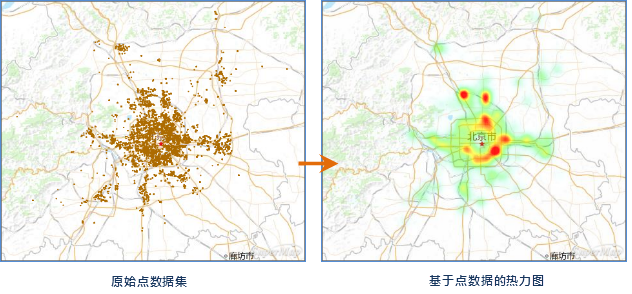
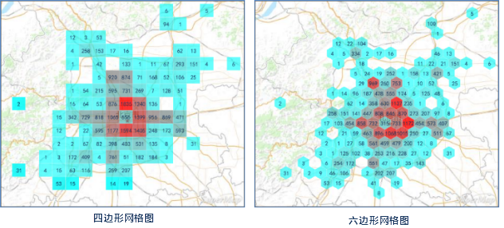

数据可视化无处不在，并且随着城市、交通、气象等数据容量和复杂性的与日俱增，大数据可视化的需求越来越大，成为人类对信息的一种新的阅读和理解方式。在GIS领域，通过大数据可视化手段进行数据分析，可以实现从密密麻麻、错综复杂的数据挖掘信息，再通过可视化的方式展示出来，使读者对数据的空间分布模式、趋势、相关性和统计信息一目了然，而这些可能会在其他呈现方式下难以被发现。

大数据可视化可以做到实时，还可以根据地图比例尺的变化实时更新分析结果。目前，应用程序提供了便捷的数据可视化功能，对点数据实现一键制作热力图或网格聚合图。

### 内容提要：

[热力图](../BigdataVisualization/AggregationMap/HeatMap)

热力图是通过色带渲染数据的各种程度信息，例如表达温度的高低程度、表达密度的疏密程度或者访问频度等，帮助人们从海量数据中快速提取有价值的信息，通过可视化的手段直观展现，因此，热力图是大数据可视化手段之一。

  
---  
  

[网格图](../BigdataVisualization/AggregationMap/GridAggregationMap)

网格聚合图是使用空间聚合方法，表现空间数据的分布特征和统计特征。SuperMap提供了两种形状的网格进行聚合显示，一种是矩形网格，一种是六边形网格。

  
---  

