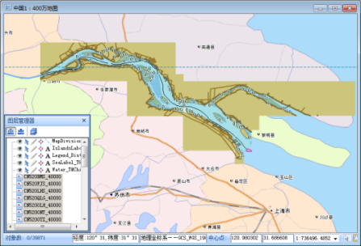

海图，是一种以海洋水域及沿岸地物为主要绘制对象的地图，为航海的安全性提供必备的数据基础。海图主要分为普通海图和专用海图两类，本文档中提到的海图指的是电子航海图（ENC，Electronic Navigational Chart），是专用海图的一种。

电子航海图，是指在内容、结构和格式上均已标准化，专为电子海图显示与信息系统(ECDIS，Electronic Chart Display and Information System)使用而由政府授权的海道测量局按照国际海道测量组织（IHO）颁布的《数字式海道测量数据传输标准》（S-57）制作并发行的数据库。ENC包含安全航行需要的全部海图信息，也可以包含纸质海图上没有的而对安全航行认为是需要的补充信息（例如航路指南）。

由于电子海图的行业专用性、全球性和实用性，决定了其在数据的生产、传输、显示、修改等方面，与一般电子地图相比需要遵循更加严格和统一的规范。国际海道测量组织（IHO）、国际海事组织（IMO）等与电子海图密切相关的国际组织多年来致力于促进
ENC 和 ECDIS 的规范发展，制定了一系列规范与标准，包括
S-57（IHO水道测量数据交换标准）、S-52（电子海图显示标准）、S-58（电子航海图有效性检核标准）等。

* **S-57** ：《数字海道测量数据传输标准》，是具有法律效力的矢量形式电子航海图的数据交换和传输标准。
* **S-52** ：《电子海图显示与信息系统海图内容与显示规范》，规定了电子海图的内容和显示，以及颜色和符号的使用细节等。
* **S-58** ：ENC数据有效性检验推荐标准，能够确保数据空间和描述属性的有效性，提高生产质量。

SuperMap 桌面产品海图模块提供了基于 S-57、S-52 和 S-58
标准的海图数据转换、显示、查询、编辑和数据验核，以及数据字典管理和环境配置，易于构建符合有关国际标准的 ECDIS：

* 基于 S-57 标准的数据转换：支持 S-57 格式数据（*.000文件）导入为 SuperMap 海图数据，并以数据集分组形式管理；支持将 SuperMap 海图数据导出为 000 文件。
* 符合 S-52 标准的海图显示：一幅海图作为一个海图图层（LayerChart）添加到地图，提供丰富的显示设置及符合 S-52 标准的海图符号动态加载，实现海图的标准显示。
* 数据字典管理和环境配置：提供途经使用户轻松获取符合标准的生产机构、物标属性、物标信息、产品规范物标信息和数据检查信息，以及对显示风格、字典文件路径进行修改。
* 海图查询：支持通过地图选择查询物标信息，或直接对数据集分组查询符合查询条件的物标。
* 海图编辑：提供基于“S-57可编辑海图数据集分组”（S57EditChartDatasetGroup）的海图编辑，包括海图信息的修改、物标数据集管理、水深管理、物标关联关系管理、拓扑关系构建与维护、物标对象的编辑等。
* 海图数据检查：依据 S-58 标准，提供必要的海图数据检查项，以及其他必要的检查，有效地保障海图数据符合 S-57 标准和产品规范。

SuperMap 桌面产品海图模块，为用户利用海图进行船舶监控提供了一个新的平台，对加快我国电子海图标准化建设具有一定的现实意义及技术价值。此外，SuperMap
海图模块突破了传统海图"重水轻陆"的局限性，支持海图数据和陆地数据的整合，使用户可以在同一平台对海图、陆图进行统一的操作和处理，真正实现海陆一体化的存储、显示、查询、编辑和发布，为海上交通运输、海陆综合应急救援、海上资源与内河航道资源开发等应用提供完美解决方案。

 