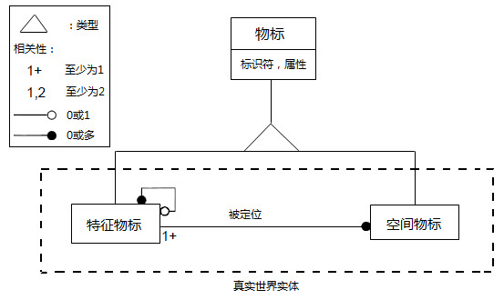
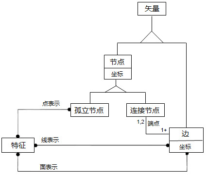

海图数据转换、显示以及发布与 S-57 电子海图数据的存储结构密不可分。下面通过特征物标与空间物标的关系、海图拓扑关系介绍海图数据的存储结构：

### 特征物标与空间物标

在 S-57 标准中，真实世界存在的实体均以描述属性和空间属性的集合形式进行表述，两种属性的集合被定义为特征物标和空间物标。特征物标是指具有真实世界实体非位置信息的物标。特征物标含有描述属性（描述实体的种类、性质、特征等属性信息）但没有任何几何属性（如关于真实世界实体形状和位置的信息）。空间物标是指具有真实世界实体位置信息的物标，主要用于描述实体的空间位置特性。特征物标由它与一个或多个空间物标的关系定位，可以不参照空间物标存在，但每个空间物标必须参照一个特征物标，如下图所示：

  
  
### 海图拓扑关系

SuperMap 桌面产品支持的海图数据模型是基于 S-57 数字海道测量数据传输标准构建的，即将真实世界实体定义为特征物标和空间物标的组合。在 SuperMap 中，采用 GIS 的通用数据模型，即面向对象的数据模型对海图数据进行表达。也就是说，SuperMap
使用空间对象（点、线、面）表达物标，每一个物标对象既包含属性信息，又表达几何形状和位置等空间信息。同时，SuperMap
海图也存储了空间物标以及海图的拓扑关系信息。

S-57 中将对真实世界实体空间特性的描述归为矢量、栅格和矩阵三种类型。其中，重点描述了矢量型空间物标，其空间关系可以划分为无拓扑、链节点、平面图及完全拓扑四个拓扑级别。海图的拓扑关系描述了特征物标如何参照空间物标以确定自身的空间信息的规则。SuperMap 桌面产品采用的是制作 ENC 数据的指定拓扑级别：链节点拓扑，如下图所示。该拓扑级别中，空间物标包括孤立节点、连接节点和边三类，并规定点状物标的参照孤立节点或连接节点，线状物标参照边和连接节点序列，面状物标参照从同一连接节点起始和终止的边的闭合环。SuperMap 海图存储了三类空间物标以及特征物标对空间物标的参照信息，从而建立起海图的链节点拓扑关系。

  

### 海图数据存储结构

S-57 电子海图采用链接节点拓扑的数据结构，以 ISO/IEC 8211作为其数据结构的封装标准，这与 GIS 的分层存储存在很大的差异。

为了便于 SuperMap 数据与 S-57 文件的数据交互，SuperMap 采用传统的 GIS 数据分层存储方式，即利用点、线、面和属性数据集存储特征物标对象，通过属性表记录的方式存储特征物标对象之间的关联关系、集合关系以及特征物标对象与空间物标对象之间的参照关系。但由于海图数据包含丰富的特征物标对象，基于 S-57 标准的数据模式和 GIS 数据分层存储结构，一个数据集对应着一种特征物标对象类型，导致一幅海图往往包含数以百计甚至更多的数据集，不便于使用，SuperMap 采用数据集分组对海图数据进行管理。通过这种存储方式，利用高效的 SuperMap 空间数据库引擎便可以保证 S-57 数据的正确存储以及修改后数据的重发布。
