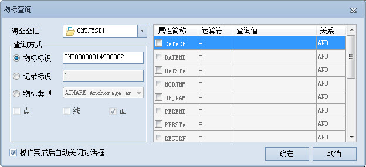
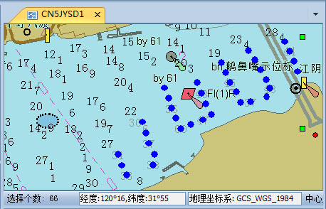

### 使用说明

海图物标查询可根据需要，查询符合条件的海图物标,方便对查询结果的进一步使用和操作。海图物标查询有三种查询方式，即物标长名、记录标识、某类物标属性值。

* 物标长名：根据指定的物标长名查询符合条件的物标，在文本框中直接输入物标长名即可。
* 记录标识：根据指定的物标在海图中的唯一标识（RCID标识），查询符合条件的物标，在文本框中直接输入记录标识即可。
* 物标属性：指定某一物标类型，通过设置属性条件，查询该类型中满足属性条件的物标。

### 操作步骤

1. 在海图编辑模式下，打开需进行查询的海图数据集分组到地图窗口中。
2. 在“地图”选项卡的“查询”组中，单击“物标查询”按钮，弹出“物标查询”对话框。 <!--    --> 
3. 如果当前地图窗口中打开了多个海图数据集分组，可单击“海图图层”右侧下拉按钮，选择需进行查询的海图分组图层。
4. 提供的查询方式有物标长名、记录标识、物标属性三种，下面以物标属性查询方式为例，介绍相关的操作步骤。
5. 选择“物标类型”单选框，单击其右侧下拉按钮，选择某一类型物标数据集，若该类型物标数据集存在多种矢量类型（点、线、面），需勾选查询物标数据集的矢量类型。
6. 在对话框右侧属性列表中，勾选属性字段作为查询条件，并双击“运算符”列中的单元格，按需选择运算符号，同时设置查询值。
7. 勾选“操作完成后自动关闭对话框”复选框，查询完成后会自动关闭该对话框。
8. 设置完相关参数之后，单击“确定”按钮，即可执行查询操作。查询完成后，“输出窗口”会提示 查找数据集的物标简称、物标中文名、结果对象数相关信息。同时查询结果会在海图中高亮显示。  
  