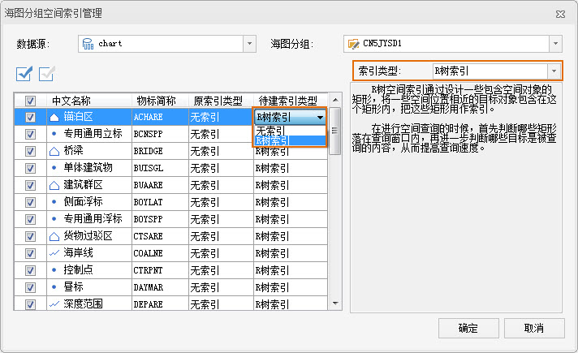

### 使用说明

海图分组空间索引管理功能，可用来管理当前选中的海图数据集分组的空间索引，包括查看海图分组中数据集的空间索引信息和为数据集建立空间索引等功能。

### 操作步骤

1. 在工作空间管理器中，选中要查看空间索引信息或者要建立空间索引的海图分组，单击鼠标右键，在右键菜单中选择“ **构建索引** ”项，弹出“海图分组空间索引管理”对话框，如下图所示，特征物标数据集列表中的所有记录对应一个海图分组的信息。  
  
2. “数据源”组合框显示了当前选中海图分组所属的数据源，可用于选择当前工作空间中的其他数据源，并管理选中数据源中的海图分组空间索引。
3. 可单击“海图分组”组合框右侧的下拉按钮，选择当前数据源中的海图分组，进行空间索引管理。
4. 对话框中的工具栏处提供了全选和反向选择两个按钮，具体操作说明如下所示： 
* 按钮：用来选中“海图分组空间索引管理”对话框左侧区域表格中的所有记录，可同意这只选中记录待建的索引类型。
* 按钮：用来反向选择“海图分组空间索引管理”对话框左侧区域表格中的记录，即原来没有被选择的记录变为选中状态；原来选中的记录变为非选中状态。
5. “空间索引管理”对话框的左侧区域以表格的形式显示了工作空间管理器中当前选中的所有矢量数据集的信息，主要显示的是数据集的空间索引类型信息，表格中每条记录对应一个数据集的信息，下面详细介绍表格各个列所表示的信息以及对话框中其他项目的作用和使用方法。 
* “ **复选框** ”列：勾选了复选框的数据集记录会重建空间索引；未勾选复选框的数据集则表示不执行重建空间索引的类型。
* “ **中文名称** ”列：显示海图特征物标数据集的中文名称。
* “ **物标简称** ”列：显示海图特征物标数据集所的物标简称。
* “ **原索引类型** ”列：显示矢量数据集当前的空间索引类型。
* “ **待建索引类型** ”列：如果想为数据集重新建立空间索引，可以通过该列指定重新建立的空间索引类型，该项默认值等于数据集的“原索引类型”值，应用系统在为数据集重新建立空间索引时将依据“待建索引类型”列的值，为相应的数据集重建指定类型的空间索引。
6. 单击选中“待建索引类型”列中的单元格，再次单击鼠标后，单元格的右侧将出现下拉按钮，单击下拉按钮，弹出下拉菜单，菜单中列出了相应矢量数据集所支持的空间索引类型，用户可以选择其中任意一种类型作为相应数据集的重建空间索引类型。
7. “空间索引管理”对话框的右侧区域中，“索引类型”组合框与左侧表格中某条选中记录的“待建索引类型”项的值关联绑定，即两者同步变化；如果左侧表格中没有选中的记录或者有多条选中的记录，“索引类型”组合框中内有任何显示内容。  
“索引类型”组合框下方，将显示“索引类型”组合框中当前显示的空间索引类型的描述信息。  
8. “ **确定** ”按钮：单击创建按钮，应用程序将根据对话框中的“待建索引类型”列的值，重建建立话框中所有的数据集的空间索引。
9. 查看或者建立数据集的空间索引后，单击对话框中的“取消”按钮，“空间索引管理”对话框。

###  备注

* 目前， 支持 R 树索引，数据库记录少于1000条，建立空间索引不利于提高查询速度，系统将不对其创建空间索引。
* 创建空间索引前，应该在对话框中取消不需要重建空间索引数据集的选择，值勾选需创建空间缩影的海图特征物标数据集。