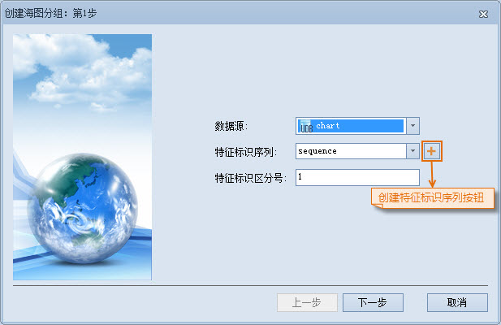
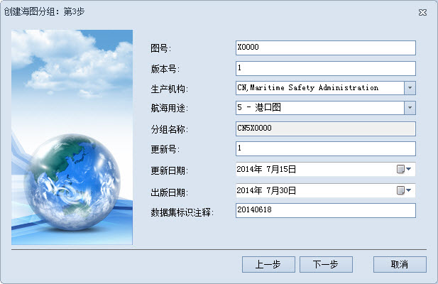
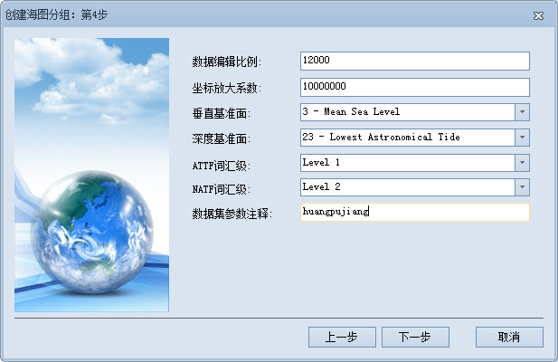

### 使用说明

生产一幅新的海图，需要创建一个新的可编辑 S-57 海图数据集分组，创建成功后，在相应的数据集分组中，除包含在创建时输入的信息外，不包含其他数据。

### 操作步骤

创建可编辑海图数据集分组需在
的海图编辑模式下进行，若当前工作环境不是海图编辑模式，则需在“开始”选项卡的“海图”组中，单击“切换到海图编辑模式”按钮，将当前工作空间切换至海图编辑模块。

以在 chart 数据源中新建 CN5X0000 海图数据集分组为例，介绍创建海图分组的具体操作：

1. 在“海图数据源管理器”中，单击 chart 数据源结点右键，选择菜单中的“新建海图分组”项，或在“开始”选项卡的“海图数据”组中，单击“新建”下拉按钮，选择“新建海图分组…”，弹出“创建海图分组：第一步”对话框，如下图所示：   
     
在上图中需设置的相关参数有：  
   * **数据源** ：单击右侧下拉按钮，选择 chart 为海图数据集分组存放的数据源。
   * **特征标识序列** ：为数据分组指定FIND，当物标对象被创建后，相应的 FOID 也被创建并分配给物标对象。单击右侧下拉按钮，选择一个特征标识序列。若在创建可编辑海图分组前，未创建特征标识序列，可单击对话框中的  按钮，创建特征标识序列。
   * **特征标识区分号** ：即FIDS，是组成特征物标标识符（FOID）的重要部分。在此处可为创建的海图数据集分组分配特征标识区分号，将其设置为1，取值范围为1-65534。
2. 完成第一步的参数设置后，单击“下一步”，设置数据范围，分别在左、上、右、下四个文本框中，输入数据范围左上、右下两点的经纬度，如输入：左：120°，上：32°，右：120.5°，下：31.8°。
3. 完成第二步的范围设置后，单击“下一步”按钮，在“创建海图数据：第3步”对话框中进行参数设置。  
   
对话框中各种各参数的介绍和设置如下所示：
   * **图号** ：是分组名称组成的重要部分之一，可设置为五个任意字母或数字等ASCII码的字符。在此设置“图号”为X0000。
   * **版本号** ：当一个 S-57 文件（000文件）最初生成时，版本号设为 1。版本号每出新版本则依次增加 1。在此设置“版本号”为 1。
   * **生产机构** ：即生产该海图数据的机构。具体生产机构代码可参阅 IHO 生产机构代码表，例如，中国海上安全监督局的机构编码为CN。
   * **航海用途** ：航海用途分为综述、一般、沿海、近岸、港口、码头泊位6种，具体划分原则可参照下表：

标识 | 航海用途 | 比例尺范围 | 可用的编辑比例尺(1:)  
---|---|---|---  
1 | 综述 | ≤1:150万 | >300万、150万  
2 | 一般 | 1:35万~1:149万 | 70万、35万  
3 | 沿海 | 1:9万~1:34.9万 | 18万、9万  
4 | 近岸 | 1:22000~1:8.9万 | 45000、22000  
5 | 港口 | 1:4000~1:21999 | 12000、8000、4000  
6 | 码头泊位 | >1:4000 |  <3999  

   * **分组名称** ：用于显示该幅海图对应的 S-57 文件（000 文件）的文件名，海图数据集分组名称由“生产机构编码+航海用途+图号”组成，例如“CN5X0000”其生产机构编码为：CN，航海用途为：5-港口，图号为：X0000。
   * **更新号** ：一个新的 S-57 文件（000 文件）的更新号定为1。与新的 S-57 文件相关的第一个更新文件的更新号为 2。更新号每连续的更新依次增加 1，可根据待制作的电子海图的版本号进行修改。
   * **更新日期** ：对 S-57 文件数据的更新必须在此日期或之前进行。单击右侧下拉按钮，在日期面板中选择更新日期即可。
   * **出版日期** ：该日期为数据制作者提供可用数据的日期。单击右侧下拉按钮，在日期面板中选择更出版日期即可。
   * **数据集标识注释** ：可在此输入数据集标识的注释信息，该文本框只能输入ASCII类型的字符，即字母和数字等，如输入数据集分组创建日期“20140618”为注释信息。
4. 完成第3步的参数设置后，单击“下一步”按钮，在“创建海图数据：第4步”对话框中进行参数设置。  
   
对话框中各种各参数的介绍和设置如下所示：  
   * **数据编辑比例** ：是指制作该海图数据时所使用的比例尺的分母值。在第3步设置的航海用途为港口，则数据编辑可使用的比例尺为1:12000，设置数据编辑比例为12000。
   * **坐标放大系数** ：是指将坐标值由浮点变为整数的乘数因子。按默认设置即可。
   * **垂直基准面** ：是指海图所标注的各个高程的起算面。应用程序提供了31个可选择的基准面，用户可根据当前海图数据所属的基准面进行选择。此处选择“3-Mean Sea Level”基准面。
   * **深度基准面** ：是指海图所标注的水深的起算面。应用程序提供了31个可选择的基准面，用户可根据当前海图数据所属的基准面进行选择。此处选择“23-Lowest Astronomical Tide”基准面。
   * **ATTF词汇级** ：是指特征记录属性字段（ATTF）的属性值所使用的字符等级。S-57 标准规定 ATTF 词汇级应为 0 级或 1 级。0级即 ASCII 文本，1级即 ISO 8859 第一部分，拉丁字母 1 系列，1 级字符集可直接用于几乎所有的计算机系统。单击右侧下拉按钮，选择Level1。
   * **NATF词汇级** ：是指特征记录国家属性字段（NATF）的属性值所使用的字符等级。S-57 标准规定 NATF 词汇级可使用 0、1、2 所有三个词汇级别。0级和1级与ATTF的定义一致，2级即通用字符集，它包括几乎所有语言，包括拉丁字符、希腊语、中文、日文等。单击右侧下拉按钮，选择Level2。
   * **数据集参数注释** ：可在此输入数据集参数的注释信息，该文本框只能输入 ASCII 类型的字符，即字母和数字等，如输入该海图数据地名为参数注释信息：huangpujiang。
5. 完成第4步的参数设置后，单击“下一步”按钮，在“创建海图数据：第5步”对话框中可浏览前4步对数据集分组所设置的所有参数。
6. 单击“完成”按钮，即可完成名为 CN5X0000 的可编辑海图数据集分组的创建，分组中会默认创建三个ENC电子海图必备的元物标(M_COVR，M_NSYS，M_QUAL)所对应的数据集，分别为：覆盖范围、航海标志、数据质量三个数据集。