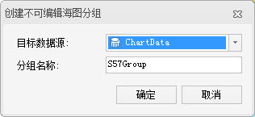

###  使用说明

为提高在同一个地图窗口中，对多幅海图数据进行浏览或查询等操作的效率，可新建不可编辑分组，通过管理不可编辑分组方式把多个海图分组数据追加到不可编辑分组中，进行浏览、查询等操作。

###  操作步骤

1. 在“海图数据源管理器”中，单击数据源结点右键，选择菜单中的“新建不可编辑海图分组”项，弹出“创建不可编辑海图分组”对话框.   
<!--   -->
2. **数据源** ：单击右侧下拉按钮，选择数据源用于海图数据集分组。
3. **分组名称** ：用于设置所创建的不可编辑海图分组名称。
4. 单击“确定”按钮，即可完成不可编辑海图数据集分组的创建。
