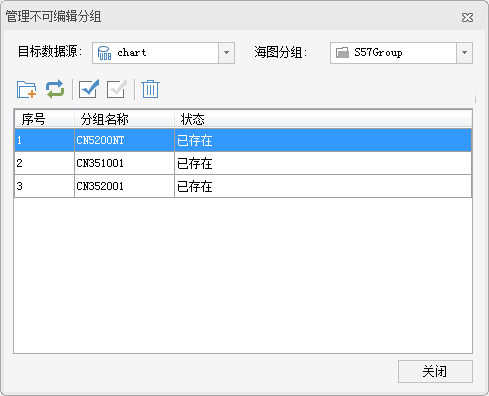

### 使用说明

通过“管理不可编辑分组”功能，可将多个不可编辑海图分组数据追加到新建的不可编辑分组中，提高多个不可编辑分组同时进行浏览、查询等操作的效率。管理不可编辑分组时，若被追加的分组中有相同的特征物标数据集，则追加成功后不可编辑分组中只保留一个数据集，是各个分组中该特征物标数据集的并集。

注意：该功能只适用于新创建的不可编辑海图分组。

### 操作步骤

1. 在“海图数据源管理器”中，单击新建的不可编辑分组结点右键，选择菜单中的“管理...”项，弹出“管理不可编辑分组”对话框，如下图所示：  
  
2. **目标数据源** ：默认显示当前选中的不可编辑海图分组所在的数据源，单击右侧下拉按钮，可选择需进行管理的不可编辑分组所在的数据源。
3. **海图分组** ：用于显示和设置需进行管理的不可编辑海图分组。
4. 对话框的工具栏处提供了海图分组的追加、更新、全选、反选、移除等功能，具体操作说明如下所示： 
   * **追加**：单击“追加”按钮，弹出“选择”对话框，通过该对话框可以选择需要的不可编辑海图分组作为更新数据。单击“确定”按钮，即可将选择的海图分组追加到指定的不可编辑分组中。追加成功的海图分组，在“管理不可编辑分组”对话框的“状态栏”处会显示“已追加”。 **注意** ：“选择”对话框中的可选分组已过滤了已追加的海图分组。
   * **更新**：若已追加的海图分组数据有所更新，可在列表中选中需更新的海图分组记录，单击“更新”按钮，在弹出的“选择”对话框中选择与选中记录同名的海图分组。单击“确定”按钮，即可将待更新的海图分组替换为所选的同名分组。更新成功的海图分组，在“管理不可编辑分组”对话框的“状态栏”处会显示“已更新”。
   * **全选**：单击“全选”按钮，用来选中列表框中的所有记录。
   * **反选**：单击“反选”按钮，用来反向选择列表框中的记录，即原来没有被选择的记录变为选中状态；原来选中的记录变为非选中状态。
   * **移除**：单击“移除”按钮，用来移除列表框中选中的一个或多个记录，即移除已追加的海图分组数据。
5. 单击“关闭”按钮，即可完成不可编辑海图数据集分组的管理操作。