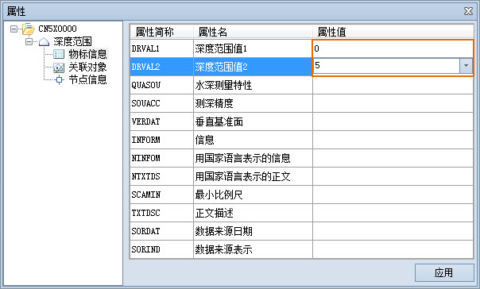
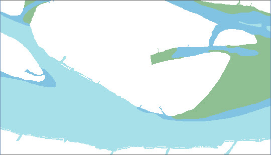

### 使用说明

SuperMap 提供了 S-52 电子海图显示风格，IHO S-52 电子海图内容和显示规范，IHO S-52
电子海图内容和显示规范，规定了电子海图的内容和显示、数据结构、改正方法和信息传输途径，以及电子海图颜色和符号的使用细节等，能够提高航行的安全性和有效性。根据
S-52 的显示标准，各类型特征物标对象显示的字段信息有所不同，创建特征物标对象时，会根据其类型指定相应的符号样式和颜色。

在海图图层中添加特征物标的操作与普通图层的操作基本一致。但每一种特征物标只能在对应的特征物标数据集中编辑，因此，若海图分组中没有需添加的物标要素对应的物标数据集，则应先在海图分组中创建或追加该特征数据集。

### 操作步骤

用户可参照已有的扫描文件或其他底图，按特征物标要素类型进行绘制。特征物标要素的几何类型主要有点、线、面三种，绘制方式基本一致，下面以绘制“深度范围”物标面对象为例，详细说明添加特征物标的操作步骤：

1. 在海图数据编辑模式下，单击可编辑分组右键，选择“在新窗口打开”，即可将该分组下的所有数据集在新窗口中打开。同时将底图数据在当前地图窗口中打开。
2. 打开可编辑海图分组后，默认所有数据集图层为可编辑状态，在“图层管理器”中，选择“深度范围”图层，在“对象编辑”选项卡的“对象绘制”组中，单击“多边形”下拉按钮，选择“任意多边形”。
3. 将鼠标移至地图窗口中，当鼠标状态为 时，即可依据相关海图资料开始绘制，其后的参数输入框会实时显示该点的坐标值。在该参数输入框中输入多边形的一个节点的坐标值（可以通过按 Tab 键，在两个参数输入框间切换）后，按 Enter 键，确定多边形的起始位置。
4. 再次移动鼠标，根据海图底图数据和相关材料，直接通过鼠标确定结点位置，或者输入结点坐标值，依次绘制多边形边界线，单击鼠标右键，闭合多边形。
5. 绘制完成一个物标对象后，双击该对象，或者选中该对象并右键选择“属性”，打开“属性”对话框。在对话框中选中“物标信息”结点，并在右侧的 DRVAL1和 DRVAI2 字段的“属性值”中，输入该对象区域的深度范围值，如下图所示：  
  
6. 重复以上步骤，依次绘制其他区域的深度范围，并赋予相应的属性值，不同的深度范围值的显示风格有所不同，最终得到绘制结果如下图所示：  
  
7. 用相似的操作方式，可继续添加其他类型的物标对象，完善海图数据的绘制。
