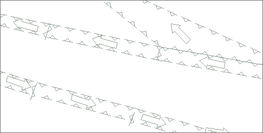

### 使用说明

追加特征物标数据集功能可将已有的特征物标数据集信息追加至新创建或已存在的特征物标数据集中。向特征物标数据集中追加记录可以实现物标对象的批量添加。被追加的特征数据集是通过指定的特征物标编码（或简称）和待追加记录集的对象类型来确定的。当指定追加的特征物标数据集不存在时，可在分组中创建一个新的特征物标数据集并追加记录。

### 操作步骤

  1. 在海图数据编辑模式下，在“ **开始** ”选项卡的“ **海图数据** ”组中，单击“物标追加”按钮，弹出“ **追加特征数据集** ”对话框。  
  2. 在“源数据”处选择追加特征物标数据集所在的数据源和数据集。
  3. 在“目标数据”处设置特征物标数据集追加到的数据源和可编辑海图分组。
  4. 单击“物标类型”右侧下拉按钮，根据待追加记录集的对象类型，来指定被追加的特征数据集类型。
  5. 勾选“特征物标数据集不存在时自动创建”复选框，若当前分组中不存在被追加的特征数据集，则会自动创建；若当前分组中已存在追加物标对应的数据集，则会将追加数据集中的数据追加至对应的目标数据集中。
  6. “字段设置”下方的字段列表中，目标字段根据目标特征物标类型显示了该类型需有的字段，源字段列表中会根据目标字段名匹配。若源字段中的字段名称与目标字段不一致，则可在该源字段列表处双击鼠标，选择相该应的字段。
  7. 单击“确定”按钮，即可将待追加记录集的对象追加导入至被追加数据集中，在地图窗口中打开海图分组即可查看追加数据集信息，如下图所示：  
  
