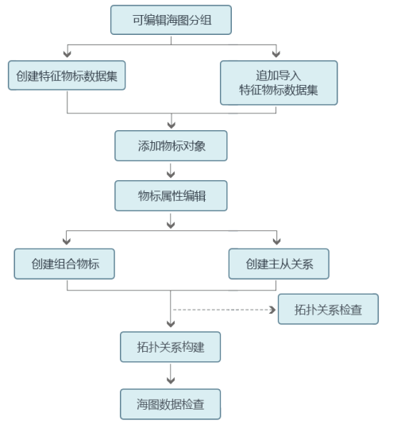

SuperMap海图模块提供的海图编辑功能，基于可编辑数据集分组中的特征物标数据集，可对相应的进行编辑。SuperMap海图模块提供了基于 S-57 标准的海图数据字典，包括生产机构信息、物标信息、物标属性、产品规范的物标信息以及 S-58 检查项信息等。每一种地理特征物标只能绘制在相对应的特征物标数据集中。

提供的海图编辑功能包括：创建或追加特征物标数据集，创建、编辑物标对象，水深点编辑，特征物标属性编辑，水深属性编辑，组合物标管理关系管理，主从物标关联关系管理等内容。海图数据编辑的主要流程如下图所示：

  
  
本章节将对这些海图编辑功能进行详细介绍。

###  内容提要：

[海图编辑流程](ChartEditorProcess.html)  
介绍海图数据生产与发布的一般操作流程，及海图数据编辑的流程。

[创建特征标识序列](CreateFOID.html)  
介绍特征标识和特征标识序列的概念，以及创建特征标识序列的相关操作。

[特征物标数据集管理](FeatureDataset.html)  
介绍特征物标数据集的相关操作，包括创建一个新的特征物标数据集、删除一个特征物标数据集、向特征物标数据集追加记录等内容。

[物标对象编辑](ChartObjectsEditor.html)  
介绍添加海图特征物标、选择物标对象、编辑物标对象、特征物标属性编辑等内容。

[水深编辑](EditSounding.html)  
介绍水深点、水深分组的相关操作内容，包括添加、删除水深点、编辑海图分组、编辑水深值等内容。

[物标关联关系管理](RelationshipManagement/RelationshipManagement.html)  
介绍特征物标关联关系的管理和维护的相关内容，包括创建组合关系、创建主从关系、修改关联关系等操作。

[海图拓扑关系管理](S57TopologyRelation/S57TopoRelation.html)  
介绍海图拓扑关系检查规则，及构建海图拓扑关系相关操作。