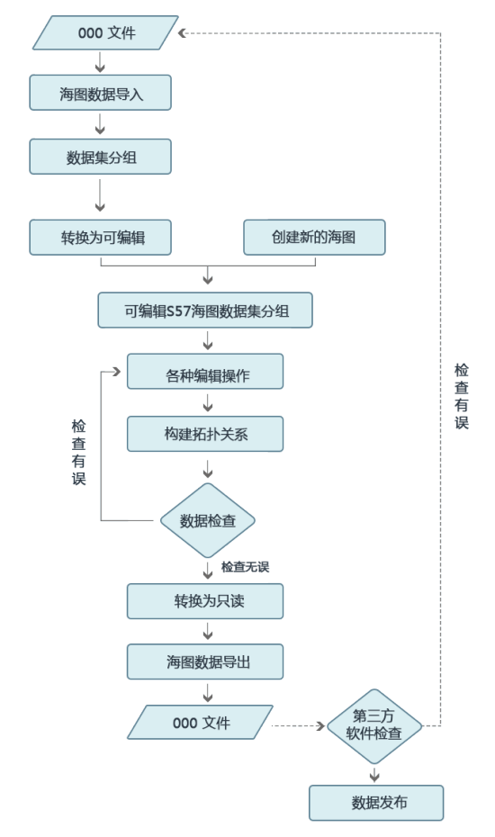

### 使用说明

提供的海图编辑功能，可以用于生产符合 S-57 标准的 SuperMap 格式海图数据，再通过海图数据转换功能将 SuperMap 格式海图导出为标准 S-57 格式数据并发布。下图展示了使用海图模块进行海图数据生产和发布的一般流程，其中红色线框内部分描述了 SuperMap 海图编辑的主要过程。

  
  
SuperMap 支持两种海图数据生产方式：一种是生产一幅新的海图数据；一种是对已有的海图数据进行修改更新。无论是从新生产数据还是对已有数据进行修改，都需基于可编辑海图数据集分组进行操作。若需生产一幅新的海图数据，则在的数据源中新建海图数据集分组，即可对海图数据进行编辑；若需修改已有海图数据，则导入000文件后，将数据集分组转换为可编辑类型数据集分组，即可对已有海图数据进行编辑修改。

海图数据集分组为可编辑类型时，可对海图数据进行各种编辑，如：添加特征物标对象、编辑对象属性、编辑水深点、创建特征物标对象关联关系等操作。在编辑完成之后，需要重新构建海图的链节点拓扑关系，然后进行数据检查，并对检查出的错误进行修改，直至检查无误。

数据检查无误后，需将海图数据集分组转换为只读类型，才可以通过海图数据导出功能将海图数据导出为 000 文件。若有需要，可以使用第三方软件对 000
文件进行检查，检查无误后发布海图数据。

严格按照以上流程进行海图数据的编辑，能够有效地保障海图数据的正确性和有效的数据交换和传输。数据检查犹如数据质量的安检员，如果未通过安检就将含有错误的海图数据发布出去，可能会给航海安全带来隐患。
