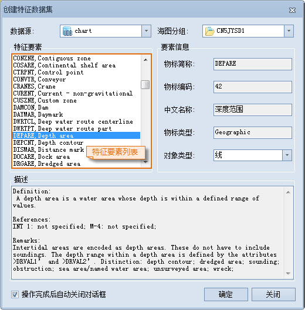

### 使用说明

根据用户定的特征物标编码和数据集类型，可创建一个新的特征物标数据集，并添加到当前可编辑 S-57 海图数据集分组中。SuperMap 提供的 S-57 物标数据字典存储了 S-57 标准附录 A IHO 物标类目所说明的特征物标的信息，包括物标名称、物标简称、物标代码、物标类型、定义、参考和备注。创建物标数据集时，可直接获取到特征物标的相应信息。

### 操作步骤

  1. 在海图数据编辑模式下，在“ **开始** ”选项卡的“ **海图数据** ”组中，单击“新建”下拉按钮，或单击可编辑海图数据集分组结点右键，选择菜单中的“创建特征数据集”项，弹出“ **创建特征数据集** ”对话框，如下图所示：  
     
  2. 在“数据源”处单击右侧下拉按钮，下拉菜单中列出了当前打开的工作空间中所有打开的数据源的别名，用户通过选择其中的一个数据源来指定新建的特征数据集所在的目标数据源。
  3. 在“海图分组”处单击右侧下拉按钮，下拉菜单中列出了当前数据源中所有的可编辑海图分组，用户通过选择其中的一个可编辑海图分组来指定新建的特征数据集所在的数据集分组。
  4. “特征要素”列表中，列举了所有符合 S-57 标准的特征物标数据集类型，用户可根据需要再列表中选择一种数据集类型进行创建。
  5. 选择特征数据集类型后，“要素信息”处会显示该特征要素的物标简称、物标编码、中文名称、物标类型和对象类型信息。单击“对象类型”右侧下拉按钮，选择特征物标几何对象类型。
  6. “描述”下方的文本框用于显示当前选中的特征要素的定义、参照信息和备注信息。
  7. 单击“确定”按钮，即可在选定的可编辑分组中创建指定的特征物标数据集。