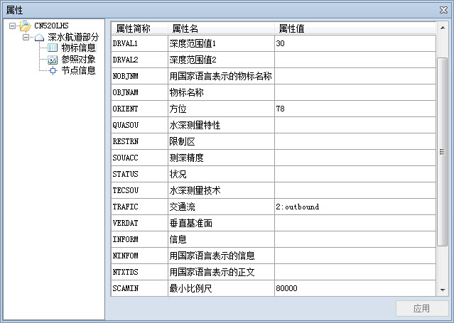
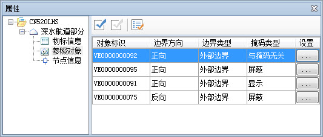
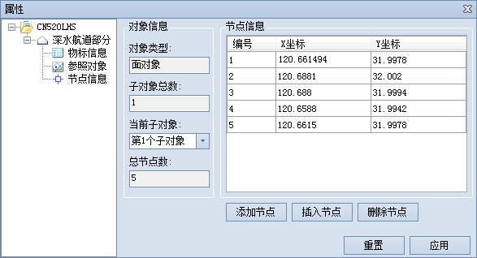

### 使用说明

物标属性是用于描述物标的特性，绘制完的特征物标对象，需编辑其属性，赋予相应的属性值。各类型特征物的标属性信息有所不同，S-57 物标属性数据字典存储了
S-57 标准附录 A IHO 物标类目的说明，包括属性的名称、简称、代码、类型、属性值的期望输入、定义、参考、格式、所属集合等。

### 操作步骤

1. 在可编辑分组海图中，选中一个或多个物标对，右键选择“属性”项，或者双击某一对象，打开“属性”对话框。物标属性包括物标信息、参照对象、节点信息。
2. **物标信息** ：单击“属性”对话框左侧物标名称目录树中的“物标信息”结点，对话框右侧区域将显示该物标对应的属性简称、属性名、属性值，如下图是某个“深水航道部分”物标对象的属性。用户可在“属性值”列中编辑、修改物标属性值。  
     
3. **参照对象** ：单击“属性”对话框左侧物标名称目录树中的“参照对象”结点，对话框右侧区域将显示选中物标对象的边界信息，包括对象标识、边界方向、边界类型、掩码类型等，如下图是选中物标参照对象的属性。  
   
   * 对象标识：由矢量记录标识符字段（VRID）的两个子字段 RCNM 和 RCID 连接而成。其中，RCNM 占 2 字符，用以区分空间物标的类型，以“VI”表示“孤立节点”，“VC”表示“连接节点”，“VE”表示“边”；RCID 为10个字符的数值。
   * 边界方向：是指特征物标对线状空间物标对象方向的参照方式，公有正向、反向、与方向无关三种。正向是指与线空间物标对象的节点次序方向一致；反向是指与线空间物标对象的节点次序方向相反。
   * 边界类型：用于表示该参照边的边界类型，有外部边界和内部边界两种。
   * 掩码类型：参照边的掩码指示有三种：屏蔽、显示、与掩码无关，可设置参照边是否显示。
   * 设置：单击“设置”列中的按钮，可在弹出的“属性设置”对话框中设置空间物标包含的水平基准面（HORDAT)、位置精度（POSACC）和位置性质（QUAPOS）三个属性。
4. **节点信息** ：单击“属性”对话框左侧物标名称目录树中的“节点信息”结点，对话框右侧区域将显示构成对象的节点的相关信息，主要以表格的形式显示，如下图所示：  
    
   * 对象信息：用于显示选中对象的对象类型、子对象总数、当前子对象、总结点数等信息。
   * 节点信息：表格区域显示当前子对象的节点信息，每条记录对应子对象的一个节点，信息内容为节点的坐标信息，坐标单位为度。可以通过添加节点、插入节点以及删除节点的方式修改对象节点的坐标信息。在修改过程中，若不想保留对节点坐标的修改，可以使用“重置”按钮，重置对象所有节点坐标值；修改完坐标值后，单击右下角的“应用”按钮，即可应用所作的修改。