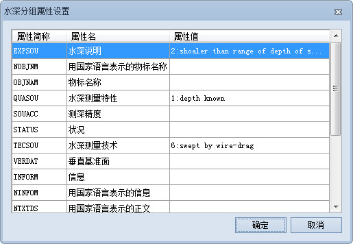
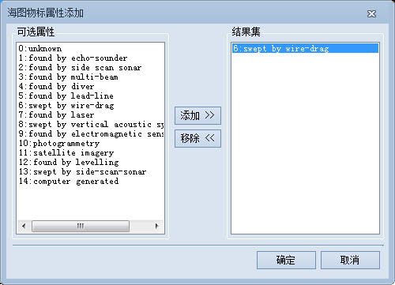

###  使用说明

由于一个水深组中所有的水深点对象具有相同的属性和值（深度除外），因此，修改水深组的物标属性值，会修改水深组所包含的所有水深点对象的属性值。

###  操作步骤

1. 在窗口中打开可编辑海图分组，单击“地图”选项卡“数据管理”组的“水深管理”按钮，弹出“水深点分组管理”参数面板。
2. 在“水深点分组管理”面板的水深点分组列表中选中某一水深分组，单击工具栏中的“编辑分组”按钮，弹出“水深分组属性设置”对话框。  
  
3. 在“水深分组属性设置”对话框的属性值列表中，编辑相应的属性信息，可修改水深分组的属性信息，以下列几项属性值设置为例，说明修改属性的具体操作： 
   * 水深说明：单击“水深说明”对应的属性值单元格，单击下拉按钮选择“2：shoaler than range of depth of surrounding depth area”选项。
   * 水深测量技术：单击水深测量特性对应的属性值列表框，并单击按钮，弹出“海图物标属性添加”对话框，在“可选属性”处选择“6：swept by wire-drag”，单击“添加>>”按钮，在“结果集”处选中改项属性，单击“确定”按钮即可。
  
   * 最小比例尺：在“最小比例尺”对应的属性值文本框中，直接输入最小比例尺数值，如40000，即可将水深点最小可见比例尺设置为1:40000。
4. 用户可根据需要设置其他属性，单击“确定”按钮即可。