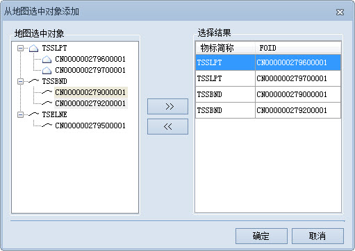

### 使用说明

组合物标是用来描述物标之间关系的一类物标，它可以参照除自身以外的其他物标对象，表达这些物标对象之间的关系，因此组合物标只具有特征信息而没有空间信息。在
SuperMap
海图中，组合物标使用纯属性表存储，一个组合物标对象对应其中的一条记录。组合物标因为不具有空间关系而使用纯属性表存储，组合物标与其参照物标对象的关联关系存储于属性表中。

依照 ENC
产品规范，可以使用“集合特征物标”（C_AGGR）和“关联特征物标”（C_ASSO）两种组合物标，不允许创建“上下关系特征物标”（简称为“C_STAC”），并且集合特征物标和关联特征物标只允许表达等同关系。

**集合特征物标**
：用于表示两个或多个物标对象的聚集，通过“是……的一部分”、“由……组成”等方式将若干物标对象组合成高级的物标。例如分道通航制分道和边界等组合成为一个交通带；又如海图中同一命名的码头往往由多个码头构成。

**关联特征物标** ：用于表示两个或多个物标对象之间的关联关系，例如一个浮标标记一艘沉船。

集合物标与关联物标的创建操作基本一致，下面以将分道通航制分道和边界物标创建为集合物标为例，详细说明组合关系创建的具体操作：

### 操作步骤

1. 在海图数据编辑模式下，打开可编辑海图分组，在“ **地图** ”选项卡的“关系管理”组中，单击“组合关系”按钮，弹出“组合关系管理”面板。
2. 单击面板工具栏的添加下拉按钮，选择“集合物标”选项，即可创建一个集合（C_AGGR）属性表数据集，用来存储集合物标对象记录。
3. 组合特征物标关系的参照物标有两个添加方式，一种是从选中对象添加，一种是从数据集添加： 
  * **从选中对象添加** ：在海图中选中要创建组合关系的分道通航制分道和边界物标，单击工具栏处的按钮，弹出“从地图选中对象添加”对话框。“地图选中对象”列表中列举了海图中所有选中的物标简称和长名，依次选中分道通航制分道和分道通航制边界物标，并单击添加按钮，将左侧选中的物标添加到右侧“选择结果”列表中。   

  

  * **从数据集添加** ：单击工具栏处的 按钮，弹出“从数据集添加”对话框。单击“物标简称”右侧下拉按钮，依次选择TSSLPT_R和TSSBND_L数据集，并在左侧列表中选中物标对象，单击添加按钮，将分道通航制分道和分道通航制边界物标依次添加到 “选择结果”列表中。

4. 单击对话框中的“确定”按钮，即可将“选择结果”中的物标添加为集合特征物标的参照物标。
5. 单击面板中的“应用”按钮，才能完成集合特征物标关系的创建。此时，海图分组下会增加一个“集合”属性表数据集。
