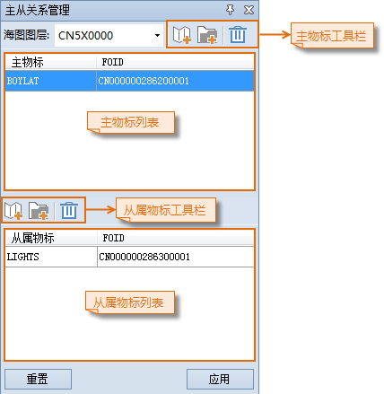
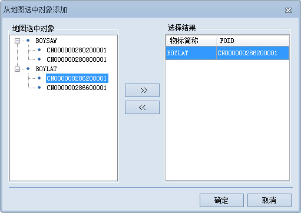
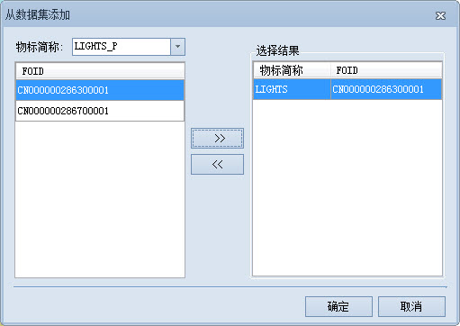

### 使用说明

主从关系用于表达具有等级的关系，例如灯浮标可看做主物标，顶标、闪光和雾号可看作其从属物标。一个主从关系只能指定一个主物标对象，但可以指定一个或多个从属物标对象，且主物标的从属物标个数不能小于1。

下面以添加侧面浮标为主物标，灯标为从物标为例，详细说明创建新的主从关系的操作：

### 操作步骤

  1. 在海图数据编辑模式下，打开可编辑海图分组，在“ **地图** ”选项卡的“关系管理”组中，单击“主从关系”按钮，弹出“主从关系管理”面板。  

  

  2. 先添加主从关系的主物标，再添加主物标的从属物标，添加方式有从选中对象添加和从数据集添加两种。
  3. 在海图中选中侧面浮标等物标，单击主物标工具栏的添加按钮，弹出“从地图选中对象添加”对话框。在“地图选中对象”列表中，选中BOYLAT物标数据集中的一个侧面浮标对象，将左侧选中的物标添加到右侧“选择结果”列表中，并单击“确定”按钮，添加该物标为主物标。 

**注意** ：“地图选中对象”列表中只列举 S-57 标准中规定的可作为主物标的物标对象，且一次只能添加一个主物标，不能添加多个。

  
  
  4. 单击“从属物标”工具栏处的添加按钮，弹出“从数据集添加”对话框。单击“物标简称”右侧下拉按钮，依次选择LIGHTS_P数据集，并在左侧列表中选中物标对象，将灯标物标添加到“选择结果”列表中，并单击“确定”按钮，添加该物标为从属物标。 

**注意** ：“物标简称”下拉列表中只列举 S-57 标准中规定的可作为从属物标的数据集，且一次可为主物标添加多个从属物标。

  
 
  5. 添加完主物标的从属物标后，单击面板中的“应用”按钮，才能完成主从物标关系的创建。

### 注意事项

创建主从关系的主物标对象不允许已经存在主从关系，并且，指定的从属物标不能是其他主物标的从属物标，否则创建将失败。

