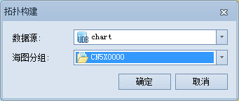

### 使用说明

当对海图数据进行了修改，原有拓扑关系不再完整正确时，就需要重新建立拓扑关系。使用 SuperMap
组件生产新的海图数据时，也需要在编辑后构建链节点拓扑关系。

ENC 产品规范规定 ENC
数据必须对空间物标创建链节点级别的拓扑关系。链节点拓扑模式下，空间物标包括孤立节点、连接节点和边三种几何类型。其中，每条边必须以一个连接节点作为其起始和终点。点状物标参照孤立节点或连接节点、线状和面状物标参照连接节点和边。

创建链节点拓扑关系就是创建空间物标对象及特征物标对空间物标的参照信息的过程，该过程将删除原有的拓扑关系然后重新构建。构建海图的拓扑关系时，系统使用的是一个默认的节点容限值，即整幅海图的范围的高或宽的百万分之一中的较大值。

### 操作步骤

  1. 在海图数据编辑模式下，在“开始”选项卡的“海图数据”分组中，单击“拓扑构建”按钮，弹出“拓扑构建”对话框。
  2. 在“拓扑检查”对话框中，设置需进行拓扑关系构建的可编辑海图分组和所在数据源。
  
---  
图：拓扑关系构建对话框  
  3. 单击“确定”按钮，执行拓扑关系构建，此时，将删除原有的拓扑关系然后重新构建，并自动修改原有错误的拓扑关系。
  4. 构建完拓扑关系后，输出窗口中会提示信息拓扑构建是否成功。

* * *

  
  
---

