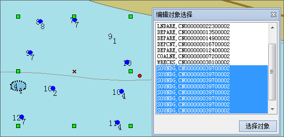

###  使用说明

在海图图层的地图上用鼠标进行选择后，可能会选中多种物标类型的多个物标对象，但通常我们希望只对一个物标对象或多个同类物标对象进行编辑，如调整节点的位置、编辑物标对象属性等。

海图模块提供了点选和矩形框选择两种方式。同时，“对象选择”功能可对点选和框选的结果进行再次筛选。

###  操作步骤

1. 在海图数据编辑模式下，当鼠标为非选择状态时，在地图窗口中单击鼠标右键，即可将鼠标切换至选择状态 ；或者在“ **地图** ”选项卡的“ **地图浏览** ”组中，单击“选择”按钮，将鼠标切换为选择状态。
2. **点选** ：用户可通过鼠标单击选择对象。当选择另一个对象后，之前已选中对象的选择状态被撤销；选择一个对象后，按住 Shift 键，再次选择其他对象时，可同时选中多个对象。
3. **框选** ：用户可通过单击鼠标左键并按住不放，沿对角线拖动鼠标，出现一个大小随着鼠标移动而变化的临时矩形。在适当位置松开鼠标左键，确定用于选择的矩形区域，则质心在矩形区域内的所有对象都被选中。可通过按住 Shift 键继续进行矩形框选择，在原有基础上增加选中的对象。
4. 由于一幅海图中的数据集较多，框选和点选容易选中一些用户需求之外的对象，可通过“对象选择”功能进行筛选。选择之后，在“对象操作”的“对象编辑”组中，单击“对象选择”按钮，弹出的“编辑对象选择”对话框中，列举了所有选中物标对象的名称和长名，可在列表中选中所需的物标对象，单击对话框中的“选择对象”按钮即可选中海图中相应的对象，或单击鼠标右键，在“选择对象”的二级菜单中选择一个物标对象。如下图所示：
  