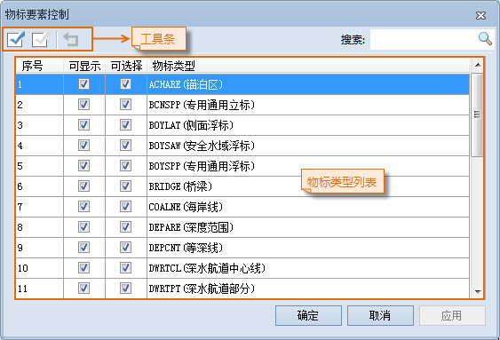
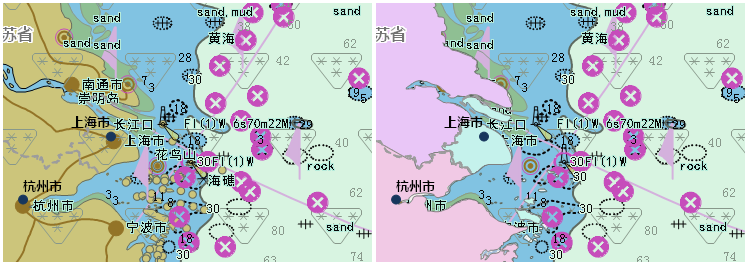
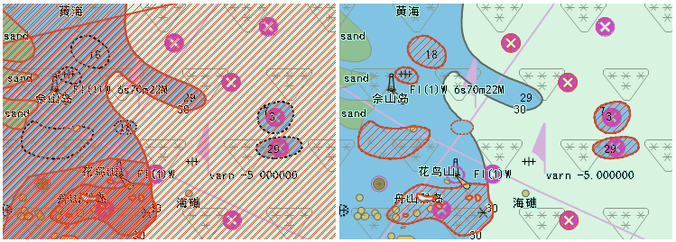

###  使用说明

“物标要素控制”窗口，用于控制当前海图窗口内物标要素的显示状态，包括“可显示”和“可选择”两种显示状态，前者控制物标要素是否可见，后者控制物标要素是否可以被选中，从而进行相关操作。

###  操作步骤

1. 在地图窗口中打开海图数据集分组。
2. 在“ **地图** ”选项卡的“ **属性** ”组中，单击“ **海图属性** ”按钮，在弹出海图属性面板中，单击“ **要素控制** ”按钮，或者在“ **海图属性** ”选项卡的“ **显示过滤** ”组中，单击“ **要素控制** ”按钮，弹出“物标要素控制”对话框，如下图所示。  
    
3. 工具条按钮说明：
   * **全选**：全部选中列表框中的所有物标类型。
   * **反选**：反选列表中的所有物标类型。
   * **重置**：将对话框中所有的设置恢复到界面刚加载的情况，但对于搜索结果不起作用。
4. 物标类型列表说明：
   * **可显示** ：通过控制物标要素在当前地图窗口中是否可见。默认状态下，当前地图窗口中的所有物标要素均可显示。   
用户可根据需求的不同来自定义海图物标要素的可见性，将不相关的物标要素设为隐藏，使海图更加简洁、便于查看。例如，在制作海图数据时，会将地球表面的海洋和与其相邻的陆地部分的信息同时绘制出来，而在使用时，需要将海图和陆图结合使用，这时就需要将海图中描述陆地的区域隐藏起来，以达到期望的显示效果。因此，用户可将陆地区物标类型设置为不可显示，即可在当前地图中隐藏所有该陆地区物标类型。  
如下图所示，海图叠加在陆图上方，左图为未设置陆地区物标显示控制的地图，此时陆图完全被海图遮盖住，导致用户无法获得陆图的相关信息，右图为设置海图陆地区为不可显示后的显示效果（即去掉陆地区物标类型前"可显示"相应位置的勾选），此时可以同时看到海图和陆图的相关信息。  
  
   * **可选择** ：用于控制物标要素在当前地图窗口是否能够被选中，从而可以对选中的物标类型开展进一步操作。默认状态下，当前地图窗口中的所有物标要素均可被选中。  
此外，可以通过鼠标单击空白区域或者使用 ESC 快捷键取消选择。  
海图的物标要素均叠加在一张图上，当选择一个或多个物标要素时，可能会同时选中多个物标要素，增加了操作的复杂度。因此，可以将需要进一步查看和编辑的物标要素的"可选择"状态设置为勾选状态，以准确便捷地查看或编辑某个或某类物标要素的属性信息。  
如下图所示，左图为当前海图在默认状态下（即所有物标要素均为可选择的状态）选择障碍物物标要素的结果示意图，右图为仅设置障碍物为可选中状态时，选择该物标要素的结果示意图。  
  
   * **物标类型** ：显示当前地图窗口内所包含的全部物标要素类型。
5. 在控制物标要素的显示方式时，用户可以选中某一物标类型，设置该物标类型的显示控制方式；也可以结合 SHIFT 键或 CTRL 键选中多个物标类型，同时对其进行显示控制的设置。选中多个物标类型以后，在修改其中一个物标类型的显示方式时，其它被选中的物标类型会同时发生相同的变化。  
根据物标要素显示控制方式的逻辑顺序，物标的"可选择"依赖于"可显示"的变化而变化，也就是说，物标要素在当前地图窗口中可见的时候，才可以继续设置该物标要素是否可以被选中。因此，在“物标要素控制”窗口中，只有勾选物标要素的“可显示”属性以后，才可以勾选“可选择”属性，否则“可选择”属性不可用。
6. 完成物标要素显示方式的修改以后，可以单击"物标要素控制"窗口右下方的应用按钮，在当前地图窗口查看修改效果。