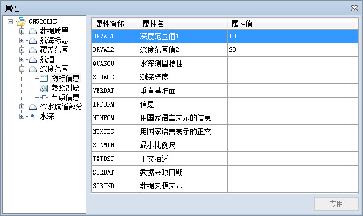

###  使用说明

提供查看和编辑海图窗口中选中的一个或多个对象的物标属性信息。物标属性信息包括基本信息、物标信息、参照对象和节点信息。其中：

* 基本信息包含物标名称、物标长名、RCID 标识、SmID、机构简称、物标编码、本地化名称、物标类型、几何对象类型、主物标长名、集合物标长名、水深值。
* 属性信息包含属性简称、属性名、属性值。
* 参照对象为选中物标对象的边界信息，包括对象标识、边界方向、边界类型、掩码类型、属性设置。
* 节点信息包含对象类型、子对象总数、当前子对象、总节点数、节点坐标信息等。

###  操作步骤

1. 在海图窗口中选择对象，使用 Shift 键或者使用拖框方式选择同时选中多个对象。
2. 在海图窗口中右键单击鼠标，在弹出的右键菜单中选择“属性”命令。
3. 弹出“属性”窗口，窗口中显示了选中物标的详细信息，包括物标的基本信息、属性信息、参照对象和节点信息，如下图所示。    

4. 单击“属性”窗口左侧目录树中的任意物标对象结点，窗口右侧区域将显示该物标的基本信息。此外，系统提供物标信息的自动定位功能，当鼠标双击单击物标对象结点时，地图窗口会自动定位到该物标要素的位置，并在地图窗口中最大化高亮显示该物标要素。
5. 通过单击某个物标对象下的属性结点，可查看该物标对象的属性信息、参照对象或节点信息，可以对相应属性进行编辑，具体请参阅：[编辑物标属性信息](../ChartEditor/EditChartObjectsAttribute)。

###  备注

如果当前海图窗口中既存在海图数据也存在普通地图数据，则在单击鼠标右键时，弹出的右键菜单中"属性"命令可用，可以查看普通地图对象的属性信息、空间信息和节点信息。