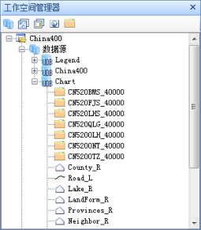
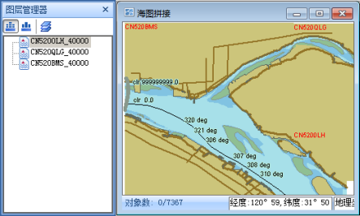
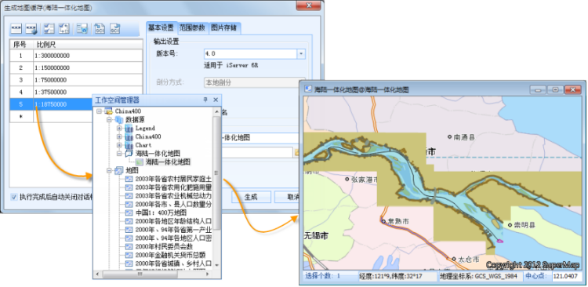

电子海图作为航海领域的一大技术突破，对保障海事安全具有重要的意义。随着海事行业对于 GIS 平台需求的增长， 产品增加对海图的支持，实现电子海图在 GIS
行业的飞跃。SuperMap 产品基于 S-57和
S-52国际标准，支持海图数据模型（*.000）的导入与导出，支持创建海图、多种颜色模式、要素显示控制、基本地图操作等。在此基础之上，我们突破传统海图“重水轻陆”的局限性，支持海图数据和陆地数据的整合与发布，真正实现海陆一体化。

###  海陆一体化存储

SuperMap 海图模块将标准的海图数据（*.000）按照数据集分组地方式进行存储，使海图数据能够和其他 GIS
数据集在管理和操作上实现统一，不用分别维护陆地和海图数据，极大地降低了维护成本。  
  

###  海陆一体化显示

  * **多幅海图的一体化显示**

当存在同一区域的多幅海图时，可以将多幅海图添加到同一个地图窗口中显示，应用程序会自动将多幅海图进行追加，实现多幅海图的无缝拼接，满足用户的显示需求。如下图所示，为三幅海图拼接后的效果图。  
  

  * **海陆一体化显示**

SuperMap 海图模块可以将拼接后的海图数据添加到地图窗口中，与二维的陆图叠加显示，真正实现海图与陆图的无缝结合，无需在两套系统中分别显示海图和陆图数据。
  

###  海陆一体化发布

SuperMap 海图模块可以对海图或者海陆一体化的地图生成地图缓存，在服务器端直接进行发布。

  
  
SuperMap 海图模块在海陆一体化存储、海陆一体化显示和海陆一体化发布方面的成功，突破了海图发展的局限性，满足了海图与陆地图数据融合使用的强大需求，为海上交通运输、海上与陆地综合应急救援、海上资源与内河航道资源开发等方面的应用提供了完美地解决方案。