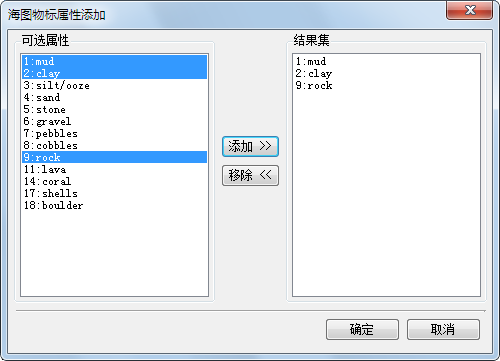

###  操作说明

编辑物标属性信息，可以修改或维护海图中物标要素的属性信息。

###  操作步骤

1. 在当前海图窗口中选择一个或多个对象。
2. 右键单击鼠标，在弹出的右键菜单中选择“物标信息”命令。
3. 在弹出的“属性”窗口中，在左侧目录树的“物标信息”结点下，选择需要修改属性信息的物标要素，此时，右侧物标属性信息列表内会列出该物标要素对应的所有属性信息。查看物标属性信息的具体方法请参见：[查看海图物标信息](Chart_Property)。
4. 找到需要修改的属性信息，单击右侧“字段值”一栏，即可编辑该物标要素的属性。

**属性字段类型介绍**

由于不同物标类型表达的地物特征不一样，其物标属性信息所包含的属性字段也不尽相同。物标属性的属性信息类型共分为列表型、枚举型、整型、浮点型、字符型五类，具体描述如下：

* 列表型：对于列表型的属性字段，选中后字段值一栏会出现“**...**”按钮，单击该按钮即可进入如下图所示的“海图物标属性添加”窗口。用户可根据需求自定义属性值，在“可选属性”栏内，结合 SHIFT 和 CTRL 快捷键选择一个或多个属性值，单击“添加”按钮，即可将选中的属性值加载至“结果集”栏中，单击“确定”按钮即可保存修改。    
列表型的属性字段可选择一个或多个属性值。例如，物标的表面组成种类（Nature of surface）就是一个列表型属性字段，一个物标可以包含一个或多个组成成分。  
  
* **枚举型：** 对于枚举型的属性字段，选中后字段值一栏会出现下拉按钮，单击即可在下拉菜单中显示相应的属性值。枚举型的属性字段只允许选择一个属性值。例如，当前物标状况（Condition）就是一个列表型属性字段，物标只可能呈现一种状态。
* **整型：** 对于整型的属性字段，选中后，可在字段值一栏的相应位置输入整型数值。
* **浮点型：** 对于浮点型的属性字段，选中后，可在字段值一栏的相应位置输入浮点型数值。
* **字符型：** 对于字符型的属性字段，可在字段值一栏输入相应的文本信息，通常用于添加物标要素的属性描述。