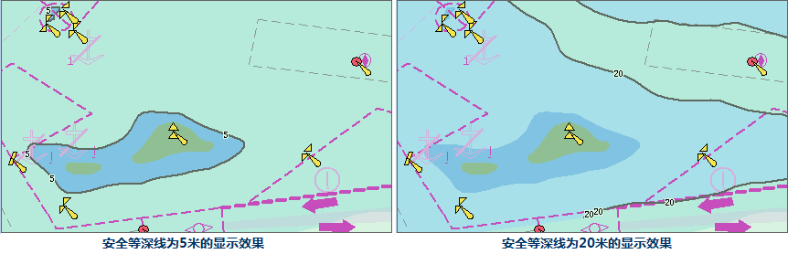

在“ **海图属性** ”选项卡及面板上的“ **水深值设置**”组中提供与水深值设置相关的功能控件，包括水深单位、安全水深点、安全等深线、浅水等深线、深水等深线等，用于设置当前海图的水深值设置。

### 设置水深颜色

“水深颜色：”标签控件右侧的组合框用来设置显示水深的颜色，颜色分为两种：两色模式和四色模式。  

  
### 设置水深单位

“水深单位：”标签控件右侧的组合框用来设置海图中水深的单位。用户可以通过单击该组合框右侧的下拉按钮，在弹出的下拉列表中选择水深单位。单位有分米、米、英尺。

### 设置安全水深

“安全水深：”标签控件右侧的组合框用来设置当前地图窗口中安全水深点的值。用户可以通过单击该组合框右侧的下拉按钮，在弹出的下拉列表中选择水深点的值，或者可以根据用户需要，在组合框中输入安全水深点的值。

### 设置安全等深线

“安全等深线：”标签控件右侧的组合框用来设置当前地图窗口中安全等深线的值。用户可以通过单击该组合框右侧的下拉按钮，在弹出的下拉列表中选择安全等深线的值，或者可以根据用户需要，在组合框中输入安全等深线的值。

  
### 设置浅水等深线

“浅水等深线：”标签控件右侧的组合框用来设置当前地图窗口中浅水等深线的值。用户可以通过单击该组合框右侧的下拉按钮，在弹出的下拉列表中选择浅水等深线的值，或者可以根据用户需要，在组合框中输入浅水等深线的值。

### 设置深水等深线

“深水等深线：”标签控件右侧的组合框用来设置当前地图窗口中深水等深线的值。用户可以通过单击该组合框右侧的下拉按钮，在弹出的下拉列表中选择深水等深线的值，或者可以根据用户需要，在组合框中输入深水等深线的值。