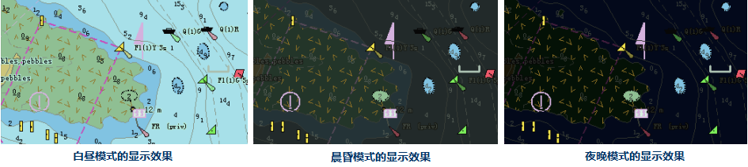

在“ **海图属性** ”选项卡及参数面板上的“ **显示设置**
”组中提供与海图显示相关的功能控件，包括显示类别、水深颜色、颜色模式、符号类型、显示字体、边界类型等，用于设置当前海图的显示效果。
  
###  设置显示类别

“显示类别：”标签控件右侧的组合框用来设置当前海图显示的类别，用户可以通过单击该组合框右侧的下拉按钮，在弹出的下拉列表中选择显示类别名称，目前显示类别只支持S52。
S52为电子海图内容和显示规范。

### 设置字体类型

“字体类型：”标签控件右侧的组合框用来设置海图中显示字体的样式。

### 设置字体大小

“字体大小：”标签控件右侧的组合框用来设置海图中显示字体的大小。

### 设置颜色模式

“颜色模式：”标签控件右侧的组合框用来设置当前海图窗口中海图数据集的颜色模式，以便于用户在各种灯光条件下都能较好的分辨海图细节且不影响用户视觉。用户可以通过单击该组合框右侧的下拉按钮，在弹出的下拉列表中选择需要显示的海图颜色模式，颜色模式分为：白昼，晨昏，夜晚。默认颜色显示模式为“白昼”。  

  
### 设置符号类型

“符号类型：”标签控件右侧的组合框用来设置当前海图窗口中的物标的显示形式。用户可以通过单击该组合框右侧的下拉按钮，在弹出的下拉列表中选择海图的符号类型。符号类型分为简单海图符号和传统海图符号。若选择“简单海图符号”，表示海图中的点符号以简单海图符号的形式显示，若选择“传统海图符号”，表示海图中的点符号以传统海图符号的形式显示。  

### 设置边界类型

“边界类型：”标签控件右侧的组合框用来设置当前海图窗口中的区域边界的显示样式，有普通边界和符号化边界两种。普通边界表示使用普通的区域边界，符号化边界表示使用符号化的区域边界。  
