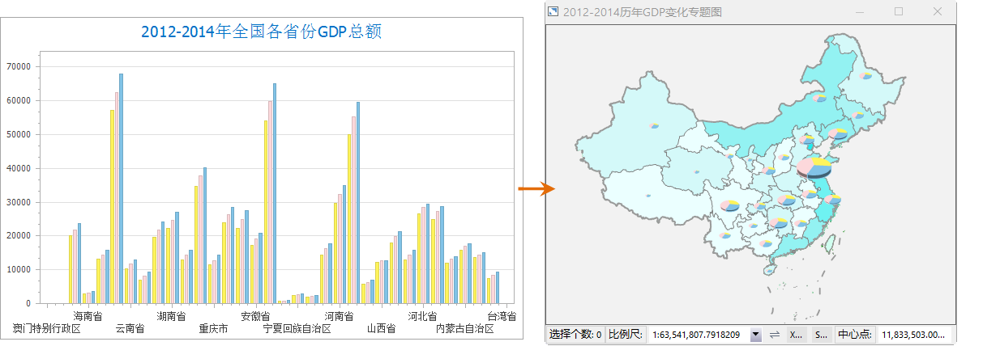
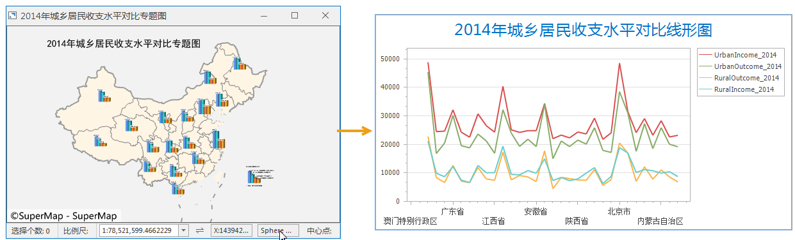

### 使用说明

在 SuperMap iDesktop 中支持对统计图表和专题图之间的互转，可快速的通过不同的方式展示数据信息。

### 操作步骤

#### 统计图表转化为专题图

支持将矢量数据集制作的统计图表转换为专题图。 **注意** ：不支持属性表制作的统计图表直接转化为专题图。

1. 在地图窗口中打开统计图表，转换入口有两处，分别是：
* 方式一：在“ **统计图表** ”选项卡上的“ **图表转换** "组中，单击“ **转换为专题图** ”按钮，弹出”转换为专题图“对话框。
* 方式二：在当前统计图表窗口中右键鼠标，在弹出的右键菜单中选择“ **转换为专题图** ”命令，弹出”转换为专题图“对话框。
2. 在“转换为专题图”对话框中，“选择地图窗口”列表框中选择转换后专题图显示方式：勾选“新建地图窗口”单选框，生成的专题图将在新地图窗口中打开。还可选择在当前工作空间中已打开的地图窗口中显示。 
3. 选择转出专题图的类型，转出类型支持多选，互转类型作如下说明：
* 支持柱状图表、饼状图表、线形图表、气泡图与单值专题图、统计专题图、等级符号专题图、点密度专题图之间的互转。

* 支持直方图与分段专题图的互转，如下图所示。
 
* 不支持将散点图表、时序图表、组合图表转为专题图。
4. 单击“确定”按钮，开始执行转换，转换完成后，地图窗口将跳转至转换后的专题图窗口。如下图为将2012-2014年全国各省GDP总额分布的柱状图转换为单值专题图和统计专题图。  

  

#### 专题图转换为统计图表

支持将用户制作的专题图转换为统计图表，

1. 在地图窗口中打开专题图，在图层管理器中选中一个矢量专题图层，右键单击，在弹出的右键菜单中选择“转换为统计图表”，弹出“转换为统计图表“对话框。 
2. 在“转换为统计图表”对话框中，“选择地图窗口”列表框中选择转换后统计图表显示方式：勾选“新建地图窗口”单选框，生成的统计图表将在新地图窗口中打开。还可选择在当前工作空间中已打开的其他统计图表窗口中显示。 
3. 选择转出统计图表的类型，一次只能转出一个图表类型，互转类型作如下说明：
* 支持单值专题图、统计专题图、等级符号专题图、点密度专题图与柱状图表、饼状图表、线形图表、单气泡图之间的互转。

* 支持分段专题图与直方图的互转。
 
4. 单击“确定”按钮，开始执行转换，转换完成后，地图窗口将跳转至转换后的统计图表窗口。如下图为将2014年城乡居民收支水平对比专题图转换为线形图表。  

  
