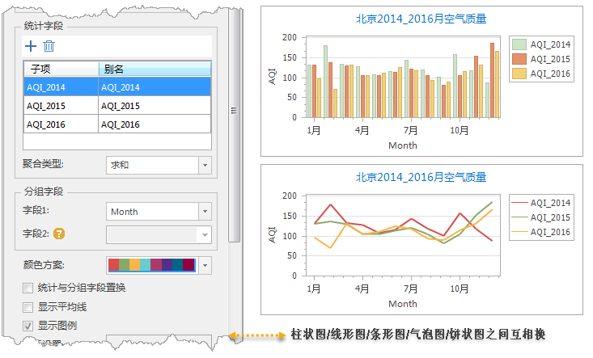
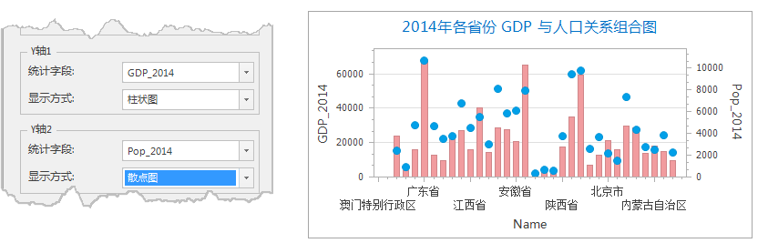
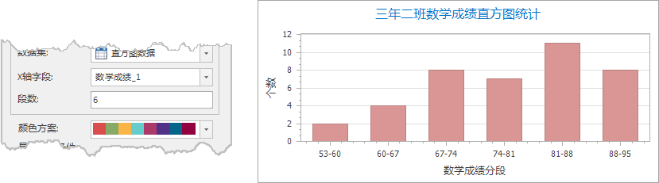
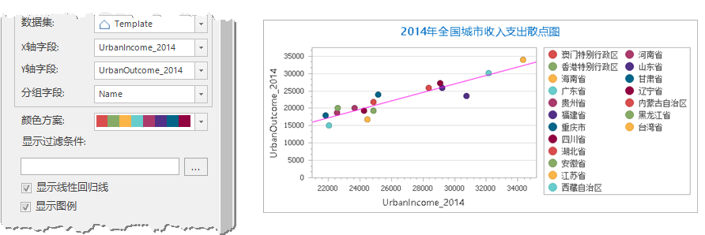
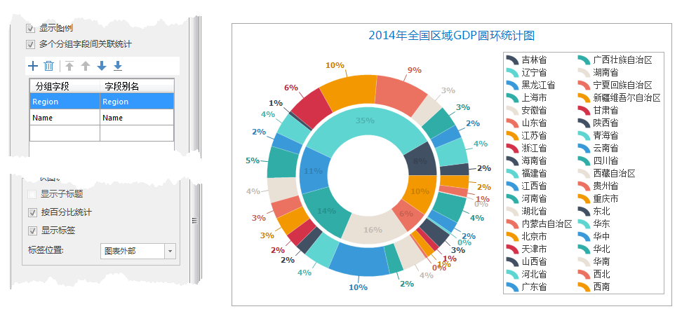

### 使用说明

在 SuperMap iDesktop
中支持对属性表、矢量数据集制作统计图，支持的图类型包括：柱状图、饼状图、线型图、气泡图、组合图、散点图、时序图、直方图等11种统计图。

### 创建统计图

创建统计图您需要经过以下几个必要步骤（对于所有可用类型相同)如下：

**第一步：创建图表** ：选择图表类型，创建统计图表，创建入口有两处，分别是：

* **方式一** ：在工作空间管理器中打开数据源，在“ **开始** ”选项卡上的“ **浏览** "组中，单击“ **统计图** ”下拉按钮，选择需要制作的图表类型。
* **方式二** ：在工作空间管理器中选中需制作统计图的数据集，右键点击“ **添加至统计图** ”，选择要制作的图表类型。

**注意**
：通过以上任一方式将弹出对应的统计图示意图窗口和统计图属性设置面板，提示用户在统计图属性面板中需设置统计字段、分组字段等参数以完成统计图表的制作。

**第二步：统计图表参数设置**
。统计图属性面板的参数有差异，其中柱状图、饼状图、线形图，气泡图以及条状图的统计图面板的参数相同，其余组合图、圆环图、面积图、时序图面板参数都各不相同。以下将对统计图表的通用参数及各类型图表的
特有参数分别进行介绍。

#### **第三步：通用参数设置**

* **数据设置** ：在数据设置组中可修改制图当前统计图的数据源及数据集，并可通过构建SQL查询的表达式来设置数据集显示过滤条件。有关过滤条件设置请参看“构建SQL查询的表达式”。
* **统计字段** ：选择数据集中某一属性字段作为统计图的统计字段，该字段一般沿 Y 轴显示。支持对多个属性字段进行统计，即可添加多个统计字段。例如：当用户需要多个年份的数据进行统计分析时，将需要统计的多个年份字段均作为统计字段。
* **聚合类型** ：聚合类型是统计字段用来计算统计字段的值的方式。程序提供6种聚合类型，分别是：单值个数、求和、平均值、中位数、方差、标准差。用户根据统计需求选择具体的聚合类型。   
      * **单值个数** ：当聚合类型为”单值个数”时，统计字段的值即为分组字段值的单值个数  
      * **求和** ：当聚合类型为”求和”时，统计字段的值即为分组字段中所选的属性值的总和。  
      * **平均值** ：当聚合类型为”平均值”时，统计字段的值所选分组字段的属性值的平均值。   
      * **中位数** ：当聚合类型为“中位数”时，统计字段的值即为所选统计字段的属性值的中位数。  
      * **方差** ：当聚合类型为”方差”时，统计字段的值即为所选统计字段的属性值的方差。  
      * **标准差** ：当聚合类型为”标准差”时，统计字段的值即为所选统计字段的属性值的标准差。

* **分组字段** ：选择数据集中某一属性字段作为统计图的分组字段，该字段一般沿 X 轴显示。支持设置两个分组字段，字段2 是在字段1基础上进行二次分组。二次分组只支持1 个统计字段，当设置的统计字段个数大于2时，不支持二次分组。 **注意** ：时序图中的分组字段1 要求必须是日期型字段类型。
* **颜色方案** ：颜色方案是为统计图的所有统计子项的颜色渲染提供配色方案，同时会根据统计子项的个数来合理分配给每个子项一个渲染颜色。根据统计图类型和适用情况，SuperMap 将颜色方案进行分类，分为适用适用 DEM、适用于聚合图、适用统计专题图、适用单值专题图等类别，同时，颜色方案支持用户自定义，用户可根据配图需求选择相应的颜色方案，颜色方案的具体介绍和操作请参见颜色方案管理器。
* **显示图例** ：可通过勾选复选框的方式，控制是否显示图例。双击图例可对图例风格进行修改。

#### **第四步：通用风格设置**

* **显示方式** ：支持切换不同类型的统计图。例如柱状图、饼状图、线形图，气泡图以及条状图之间支持相互切换。
* **背景风格** ：程序提供11种统计图背景风格供用户选择，可通过点击标签控件下拉按钮，选择合适的背景风格。
* **标题设置** ：支持修改统计图标题及设置标题字体类型和字体大小。
* **X/Y轴设置** ：支持修改统计图X轴、Y轴的标题名称，并设置其字体类型和大小。
* **自定义极值** ：支持设置坐标统计轴显示的最大/最小极值，控制统计坐标轴的显示范围区间，使图表能更好的表现数据变化的有效范围。

### **柱状图、饼状图、线形图，气泡图，条状图以及时序图**

以上六种统计图面板的参数相同，先确定标签字段、聚合类型，颜色方案等参数后（其中通用参数的详细说明请参见通用参数描述），还需要设置以下参数。

* **标签与统计字段置换** ：勾选该复选框，即将现图中的标签字段和统计字段互换。置换后原统计字段Y轴将作为现图的X轴，原标签字段X轴将作为现图的Y轴显示。
* **显示平均线** ：勾选该复选框，在统计图中将计算统计字段的平均值以直线的形式表示在图中。若统计图中有多个统计子项，则每个统计子项都会计算其各自平均值显示在图中。
* **统计方式** ：统计方式有两种分别是：“一个或多个字段”和“单字段分组统计”。

**一个或多个字段** ：勾选“一个或多个字段”，可利用工具栏按钮在列表框中添加一个或多个子项，并对子项的别名进行设置。

**单字段分组统计**
：勾选“单字段分组统计”，“统计字段”和“分组字段“的组合框被激活。在”统计字段“右侧的下拉菜单中选择统计图的统计字段，在”分组字段“下拉菜单中选择统计字段的分组字段。并在列表框中对子项的别名进行设置。

**实例** ：以制作北京空气质量线形图为例，统计2014年、2015年、2016年三年的 AQI 指数，则设置月份为标签字段，将三年的 AQI
添加为统计子项，聚合类型按照求和方式，最终得如下图所示的统计图。

  
---  
图：统计图参数设置及结果  

### **组合图：**

* **统计字段** :组合图是由两个图组合而成的组合图形式，需要设置两个统计字段，分为：Y轴1和Y轴2。单击“统计方式”右侧下拉按钮，分别设置Y轴1和Y轴2的统计字段。
* **显示方式** :显示方式支持在柱状图、饼状图、线形图，散点图四种类型的图类型中选择，可以选择两种相同类型的，也可自由选择不同类型。

**实例** ：以制作2014年全国各省份GDP与人口之间的关系组合图为例，将 GDP_2014
设置为统计字段Y轴1，显示方式为柱状图；人口数量Pop_2014 设置为统计字段Y轴2，显示方式为散点图；最终得如下图所示的统计图。
  

### **直方图**

* **X轴字段** ：”X轴字段“右侧的下拉按钮，用来设置统计图的X轴，该字段作为直方图的分组字段。
* **段数** ：“段数”是将所设值的X轴字段进行分组，在文本框中输入具体段数值。直方图的高度即为落在该段数中的频数。

**实例** ：以制作某班级数学成绩频数直方图为例，将数学成绩设置为X轴字段，段数设为6段，最终得如下图所示的统计图。
  
---  
图：直方图参数设置及结果  

### **散点图**

* **X轴/Y轴字段** ：散点图是使用数据值作为 x,y 坐标来绘制散点位置。所以X轴/Y轴字段为数值型字段。
* **分组字段** :分组字段即为散点所代表的字段属性。
* **显示线性回归线** ：线性回归线是将X,Y两个变量通过线性回归方程的最小平方函数对一个或多个自变量和因变量之间关系进行建模从而得到一条线性回归拟合线。

**实例** ：以制作全国城市收入支出的散点图为例，将收入设置为X轴字段，支出设置为Y轴字段，省份名称作为分组字段，最终得如下图所示的统计图。  

  

### **圆环图**

* **分组字段** ：设置一个分组字段即为一个圆环，支持设置多个分组字段即生成多个圆环图嵌套在一起。可调整分组字段的子项顺序，设置圆环的嵌套顺序，默认第一个分组字段为最内环，圆环依次向外嵌套。如上图所示设置内环分组字段为各全国7个片区的 GDP（Region），外环则为各省的 GDP（Name字段），
* **多个分组字段间关联统计** ：每个圆环代表一个分组字段系列，每个分组字段之间可以设置关联关系。如下图所示，勾选设置分组字段间的关联关系，则得各片区所涵盖的省对应在各片区外显示。
* 在“风格设置”面板，可对圆环图显示做以下设置： 
* **按百分比统计** ：勾选该复选框，则统计方式即为每个统计字段占整体总和的百分比；不勾选该复选框，则统计方式即为统计字段的值。
* **显示标签** ：设置是否在圆环图中显示统计结果标签。
* **标签位置** ：设置统计结果标签显示在圆环图的位置，程序提供五种显示位置：图内部、图标外部、两列显示、放射形状以及相切显示。
  

### 统计图处理

**保存图表** ：保存图表有两种操作方式，分别是：

* 方法一：在“ **统计图** ”选项卡上的“ **统计图处理** "组中，单击“ **保存** ”按钮，弹出”保存统计图“对话框。在对话框输入图的名称，然后，点击“确定”按钮即可。
* 方法二：在当前统计图窗口中右键点击鼠标，在弹出的右键菜单中选择“ **保存** ”命令，弹出”保存统计图“对话框，在对话框输入图的名称，然后，点击“确定”按钮即可。
* 图保存后，在工作空间管理器中的统计图集合结点下将增加一个新的图结点，该结点对应刚刚保存的图。
* 若当前图是工作空间中已有的图，则会将对图的修改，保存到当前统计图中。

**转出为图片** ：将图转出为图片有两种操作方式，分别是：

* 方法一：在“ **统计图** ”选项卡上的“ **图处理** "组中，单击“ **转出为图片** ”按钮，在弹出的”保存“对话框中选择转出路径、输入转出图片名称，即完成将当前统计图转出为图片的操作。
* 方法二：在当前统计图窗口中右键点击鼠标，在弹出的右键菜单中选择“ **转出为图片** ”命令。

