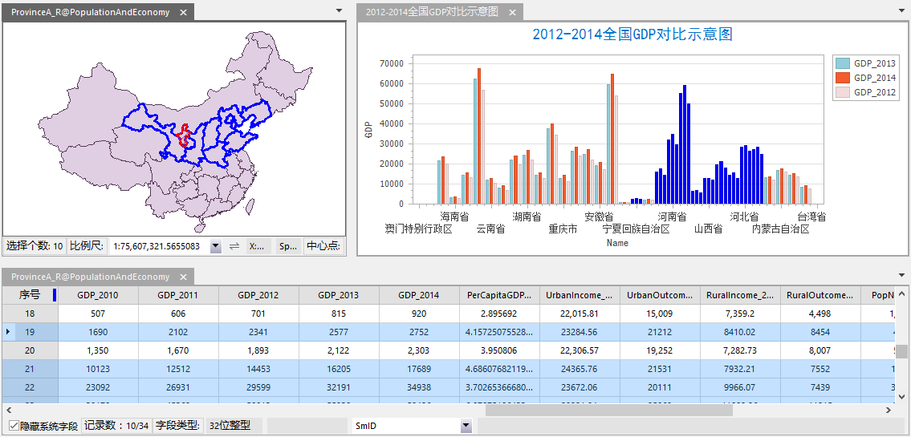
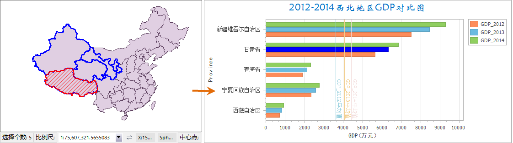

### 使用说明

在 SuperMap iDesktop 中支持图表与地图、属性表之间的联动显示，通过与图表进行交互来挖掘和获取更多信息。便于用户分析数据在地理上的分布特征。

### 操作步骤

1. 在新的地图窗口中分别打开需要联动显示的图表、地图以及属性表。
2. 在“ **视图** ”选项卡上的“ **窗口** "组中，单击“ **关联** ”按钮，弹出窗口列表，勾选进行绑定的窗口前的复选框即可进行关联浏览。 此时应用程序自动对选择的绑定窗口进行水平排列，从而便于窗口间的联动操作与浏览，如下图所示。关于关联浏览的详细描述请参见[关联浏览](../../Visualization/BrowseMap/WindowsBinding.htm)。  

  

3. 图表、地图和属性表之间的选择是动态的。如果在图表中选择一个或者多个对象，那么也将同时选中地图和属性表中的相同对象。同样，地图或属性表中的选择也将反映在图表中。选中的对象会在窗口中高亮显示。
4. **对选中对象生成统计图表** ：通过交互式选择感兴趣的对象，以此作为过滤条件，只对当前选择的对象单独创建新的图表。具体操作如下：
* 在地图窗口中选择一个或多个对象，以高亮显示感兴趣的对象，点击右键在菜单栏中单击“ **对选中对象统计** ”。
* 在统计列表类型中选择要制作的统计图表类型，即完成对单独选中的对象创建统计图表。
* 例如在全国范围内单独统计西北五省的GDP情况，即在地图窗口中选择该五个省份的图形对象，按照如上操作制作西北地区2012-2014年GDP对比图。得到如下结果：  

  

