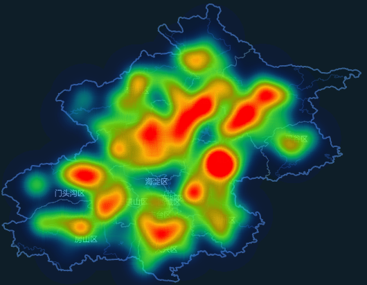
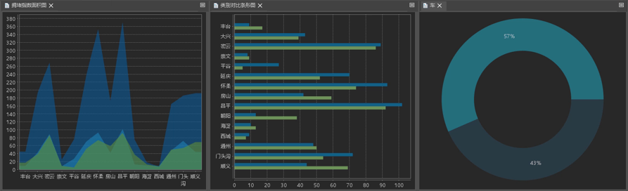

近年面对不断产生的海量数据，人们希望有新的技术和工具对大量数据进行强有力的分析，数据挖掘技术成为实现决策、支持的最佳方式。数据挖掘是一个从大型数据库中挖掘先前未知的、有效的、可使用的信息，并使用这些信息做出决策或丰富知识的过程。

统计图表的出现，为数据提供了一种图形化的表达形式。通过图表对数据进行可视化，能够直观的展示和挖掘数据的关系、分布、类别趋势和模式。可通过创建不同类型的统计图表，来展示数据之间的相互关系，找寻数据之间的相关性，深入挖掘出有价值的信息。

SuperMap
桌面支持创建不同形式的统计图表，以将数据集属性信息图形化。通过图表的构建能够直观的展示和挖掘数据的关系、结构和趋势等。常用以做分类统计或比较，例如可用柱状图表直观展示全国不同省份的GDP总额，比较各省份GDP差异；还可用于统计事件发生的频次分布，例如：
某工厂产品质量的分布情况，判断和预测产品质量及不合格率等。

在 SuperMap 桌面中，您可以执行以下操作：

  * 提供了丰富的图表类型，包括柱状图、饼状图、线形图、气泡图、组合图、散点图、时序图、直方图、条形图、圆环图、面积图等。
  * 支持对统计图表与专题图之间的互转，可快速的通过不同的方式展示数据信息。
  * 支持图表、地图、属性表间的联动显示，多种可视化的交互操作,使得在同一时间能够看到不同图表的展示效果。
  * 支持将统计图表输出为图片，可应用于 Word、PPT 等其他文档工具中
  * 提供统计图表模板，用户可以按照程序提供的模板直接制作统计图表。同时将图表风格导出为模板，以供反复使用。
  * 支持将制作完成的统计图表插入布局及地图大屏中使用。

### 示例

以下地图中展示了早高峰时段北京各区交通拥堵情况，从热力图中可看到拥堵的热点区域和冷点区域分布，从整体了解拥堵的大致位置分布，但是无法从地图中了解更精确的拥堵信息。

  

  
为了挖掘更深入的的数据信息，可利用统计图表分析道路拥堵情况获取更多深层信息，为交通管理部门疏导交通流量，及时发布交通信息及应对措施提供辅助决策，从而提高道路交通的通行效率。

  
  
### 相关内容

[**统计图表类型**](DiagramsType)

[**制作统计图表**](CreateDiagram)

[**图表与专题图的转换**](ConvertThemticMap)

[**与图表联动交互**](ConvertThemticMap)

[**使用统计图表模版**](DiagramTemplate)

