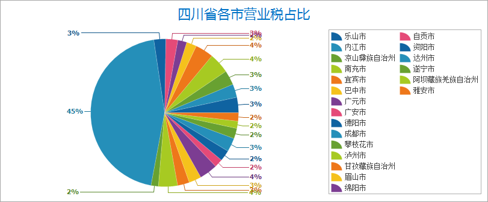
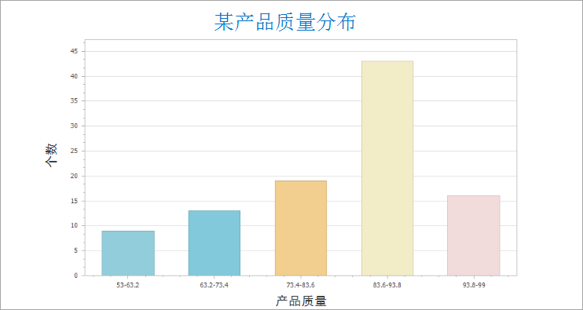
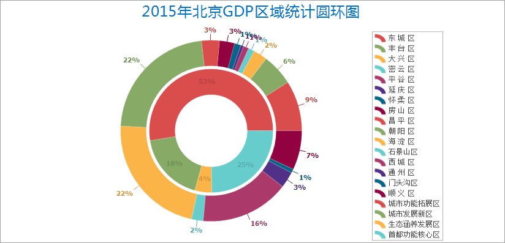

在 SuperMap 桌面中，提供了丰富的统计图表类型，您可根据数据所要表达的含义，选择合适的图表类型，包括柱状图、饼状图、线形图、气泡图、组合图、散点图、时序图、直方图、条形图、圆环图、面积图等类型。

以下将对图表类型的含义、特点及适用场景进行详细描述。

### 柱状图

是一种以长方形的长度为变量的表达图形的统计图表，由一系列高度不等的纵向、横向条纹表示数据分布的情况，用来比较两个或以上的变量关系。

柱状图表特点：能够直观看出各个数据的大小，易于比较数据之间的差别。例如：统计全国不同省份的GDP，如下图所示

  

  
### 饼状图

饼状图表由一个被分割成两个或更多扇区的圆形组成。饼图强调数据与整体之间的相对关系，在展现比例和比率方面特别有用。

常用于表示部分在总体中所占的百分比。易于反映出部分与部分、部分与整体之间的数量关系。例如：下图所示为四川省某年各市营业税的占比。

  

  
### 线形图

线形图表是以折线的上升或下降来表示统计数量的增减变化的统计图表。与柱状统计图表比较，折线统计图不仅可以表示数量的多少，而且可以反映同一事物在不同时间里的发展变化的情况。

线形图表的特点是能够显示数据的变化趋势，反映事物的变化情况。例如：北京2014-2017年每月的空气质量折线图。如下图所示:

  

  
### 气泡图

气泡图表是一种特殊类型的XY散点图，变量Y为气泡大小的决定字段是以X轴和Y轴标识出气泡点位置，以第三个变量的值表示气泡大小。

常用于查看分类数据的关联方式。

  
 
  
### 组合图

组合图表，就是两种及以上的图表组合而成的图表形式。组合图表可以是两个柱状图、两个折线图或者一个柱状图和一个折线图的组合。要制作组合图表，必须具有两个包含常用字符串字段的不同数据集。

组合图表可以回答有关数据的问题，例如：2014年全国各省份GDP与人口之间的关系。

  

  
### 散点图

散点图表使用数据值作为 x,y 坐标来绘制点。它可以揭示格网上所绘制的值之间的关系，还可以显示数据的趋势。

散点图表适用于表示两个变量之间的关系、分布方式以及根据分布方式发现异常值。例如：市政工程部门统计自来水管道漏点数与管道总长度之间的关系。

### 直方图

直方图实质上是一个频率分布图，它会将源数据值归到各个条柱或组距中。列高度表示落在每个条柱中的项目数的频数。

它是一种很直观的图表类型，能够显示各组频数分布的情况，易于显示各组之间频数的差别。例如：表示某工厂产品质量的分布情况，判断和预测产品质量及不合格率。

  

  
### 条形图

条形图是用每个条带的长度表示一定的数量，根据分类的数值量生成长短不同的直条，用于汇总并比较分类数据。

通过此类数值表达方式，能够直观的了解分类数值之间的相对差异。例如：创建一个条形图，对西北五省2012-2014年GDP进行对比。

  

  
### 面积图

面积图强调数量随时间变化的速度，也可用于引起人们对总值趋势的注意。

当用户需要建立总体-
部分之间的关系时，即分类数据之间存在求和关系时，能够直观的发现数据之间的关系。例如：通过创建面积图来展示成本和收入之间的关系。得到如下图所示的面积图。

  

  
### 圆环图

圆环图与饼状图表相类似，能够显示各个部分与整体之间的关系。例如：统计某超市不同商品分类的营业额占比。

  

### 时序图

时序图，是用横轴表示时间，纵轴表示在不同时间序列中具体变量值。通过时序图能直观的看出每个变量在各个时刻的状态，并能方便的比较查看变量的状态。

  

  
###  相关内容

[**统计图表概述**](Diagrams1)

[**制作统计图表**](CreateDiagram)

[**图表与专题图的转换**](ConvertThemticMap)

[**与图表联动交互**](ConvertThemticMap)

[**使用统计图表模版**](DiagramTemplate)

