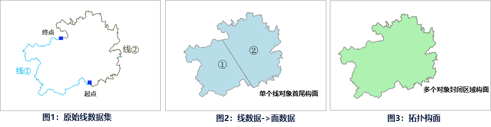
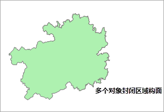
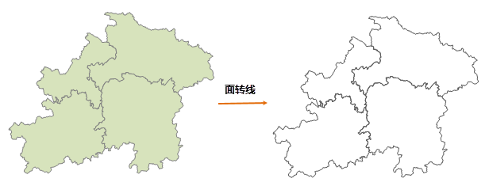

线数据与面数据的互转包括：线数据转面数据和面数据转线数据两种方式。

### 线数据转面数据集

线数据转面数据是通过将线数据集中每个线对象的起点与终点相连接而构成一个面对象，起点与终点的连接方式是最短距离的直线连接构成一个面对象。

当线对象为单一直线且构面的面积为0时，则该对象构面失败。常用于当用户需要以单个线对象进行构面操作时。若用户想要将多个线对象构成的封闭区域进行构面时，可使用“拓扑构面”功能，请参看“[拓扑构面](../Topology/TopotoPolygon.html)”。

“线转面”和“拓扑构面”的区别在于：线转面是将单个线对象首尾连接构面，而拓扑构面是将多个线对象封闭区域进行构面，如下图所示：

 |  |  
---|---|---  
图1：原始线数据集 | 图2：线数据->面数据 | 图3：拓扑构面  
  
  * 如果输入的线图层包含复合对象，输出的面数据仍为复合对象，可以通过使用分解功能，将转换后的面对象分解为简单对象。
  * 新生成的面数据集（或追加后的数据集）继承源数据集的字段 SmUserID 和所有非系统字段的属性信息。

**功能入口**

  * 单击 **数据** 选项卡-> **数据处理** 组-> **类型转换** 按钮，在弹出的菜单中选择“线数据->面数据”。
  * **工具箱** -> **类型转换** -> **点、线、面类型互转** 工具：线数据->面数据。(iDesktopX) 

在弹出的“线数据->面数据”对话框中设置待转换的数据集，及结果数据集名称和所存的数据源，同时支持设置 **拓扑处理**
，可在数据转换的同时处理拓扑错误，有关拓扑处理的详细描述可参看[线拓扑处理](../Topology/TopoProcessLine.html)，
**注意** ：该操作会修改源数据，请在拓扑处理前进行数据的备份工作。

### 面数据转为线数据

通过将面对象的边界转化为线，从而创建一个包含线对象的数据集。

  * 输入的面数据的属性信息能够全部保留。新生成线数据会继承源数据集的字段 SmUserID 和所有非系统字段的属性信息。
  * 多个面数据转为线数据时，生成的线数据的投影与源数据（转换前的面数据集）的投影保持一致。
  * 输入的图层包含复合对象，输出的线仍为复合对象，可以通过使用分解功能，将转化后的线对象分解为简单对象。

**功能入口**

  * 单击 **数据** 选项卡-> **数据处理** 组-> **类型转换** 按钮，在弹出的菜单中选择“面数据->线数据”。
  * **工具箱** -> **类型转换** -> **点、线、面类型互转** 工具：面数据->线数据。(iDesktopX) 

在弹出的“面数据->线数据”对话框中设置待转换的数据集，及结果数据集名称和所存的数据源，即可执行转换操作。

  
---  
