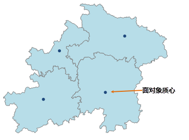

### 使用说明

支持持将面数据转为点数据，即通过将面数据集中的每个对象的质心提取出来生成一个新的点数据集。新生成的点数据集会继承源数据集的 SmUserID
和所有非系统字段的属性信息。 常用于当用户想要用点数据表示对象位置信息时，可将已有的面数据转为点数据，同时保留了面对象的属性值又能精确的表示面内的位置信息。

  

### 操作步骤

  1. 在“ **数据** ”选项卡的“ **数据处理** ”组中，单击“ **类型转换** ”按钮的下拉箭头，在弹出的菜单中选择“面数据->点数据”。
  2. 弹出“面数据->点数据”对话框，在对话框中设置待转换的数据集，及结果数据集名称和所存的数据源。
  3. 设置完成后，单击“转换”按钮，完成操作。

