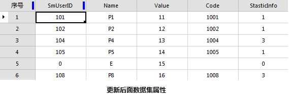

点属性转为面属性是指把点数据属性中的非系统字段值更新到对应面数据的属性中。该功能是将面对象中的点属性更新到面属性中，若一个面内包含了多个点，则会从其中随机选择一个点，将其属性更新到所在的面对象中，同时会增加一个“StasticInfo”统计字段，用于统计每个面对象中包含的点个数。

### 使用说明

  * 转换的内容包括点属性中的 SmUserID 和所有非系统字段的属性信息。
  * 若面属性字段与点属性字段的名称和类型都相同，则点属性字段值会直接更新到面属性字段中；若面属性字段与点属性字段类型不一致或无同名字段，则会在面属性中新建一个同名同类型的字段，再将点属性字段值更新至面属性字段中。

### 操作步骤

  1. 在“ **数据** ”选项卡的“ **数据处理** ”组中，单击“ **类型转换** ”按钮的下拉箭头，在弹出的菜单中选择“ **点属性->面属性** ”，弹出的“点属性->面属性”对话框。
  2. 在弹出的“点属性->面属性”对话框中，在对话框中设置待转换的数据集，及结果数据集名称和所存的数据源。
  3. 设置完成后，单击“转换”按钮，完成操作。
  

  4. 从点数据集、面数据集的属性表可看出： 
    * 点数据集和面数据集有 SmUserID、Name 两个相同字段；
    * 点数据集有一个单独字段 Code，面数据集有一个单独字段 Value；
    * 点数据集和面数据集的相同字段值不相同。

更新后得到如下结果：    

  * 增加了一个来源于点数据集的字段 Code 和一个系统生成的记录字段 StaticInfo；
  * 面数据集的原有单独字段 Value 值没有变化；
  * StaticInfo 字段值与面中更新点的数目相同；
  * 面A、B、C、D、F属性被点 P1、P2、P4、P5、P8 更新，SmUserID 和 Name 值均更新为对应点对象的属性值。

