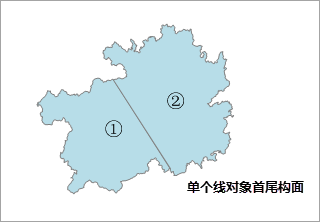
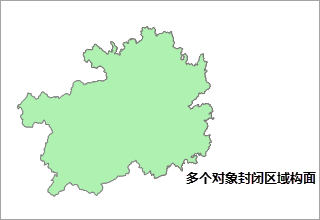
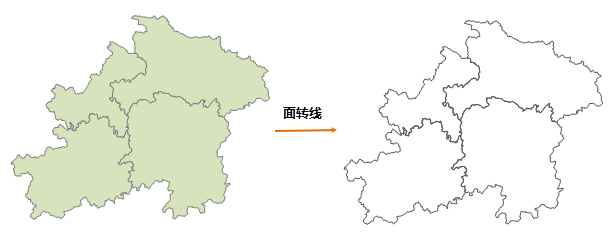

### 点数据转为线数据

点数据转为线数据是把指定的连接字段值相同的点，按照指定的排序字段和排序类型连接成一个线对象，进而生成新的线数据集。

可用于将带有时间字段的轨迹点数据，按照时间顺序生成轨迹线，以模拟出点数据运行的轨迹。

  * 对于点数据集中的连接字段值相同的点，系统会将它们连接为同一个线对象；若连接字段的某个字段值只有一个点对象，或者点对象的连接字段值为空，则默认不处理该点。
  * 生成的线数据会保留点数据连接字段的属性信息。

**功能入口**

  * 单击 **数据** 选项卡-> **数据处理** 组-> **类型转换** 按钮，在弹出的菜单中选择“点数据->线数据”。
  * **工具箱** -> **类型转换** -> **点、线、面类型互转** 工具：点数据->线数据。(iDesktopX) 

**参数说明**

  * **连接字段** ：选择连接字段，应用程序会根据指定的连接字段，将字段值相同的点对象连接成一个线对象。
  * **排序字段** ：选择排序字段，应用程序会将字段值相同的点对象按照指定的排序字段的顺序连接成一个线对象，默认值为SmID 顺序。例如，存储了时间字段的轨迹点数据，将时间字段设置为排序字段，则线对象会按照时间先后顺序连接成轨迹线。
  * **排序类型** ：支持 **升序** 和 **降序** 两种排序方式。

**注意事项**

  * 连接字段支持设置数值型、宽字符型和文本型字段，其他类型字段不支持。
  * 若点数据集中所有点对象的连接字段值为空，或连接字段值都为唯一值，或连接字段值部分为空部分有值，并且非空字段值唯一时，转换为线数据集会失败。

**实例** ：现有一份出租车轨迹点数据，按照运行的时间字段作为排序字段，生成出租车行驶轨迹的线数据集。

  
---  
  
### 线数据转为点数据

线数据转为点数据是通过将提取线数据集中所有线对象的节点，进而生成新的点数据集。

  * 对于线数据集中的参数曲线（圆、弧等），系统会将其看作是具有很多临近节点的折线，所以在转换操作时，系统会将其所有的节点都提取出来，生成点数据。
  * 生成的点数据会继承节点所在的线对象的 SmUserID 和所有非系统字段的属性信息。

**功能入口**

  * 单击 **数据** 选项卡-> **数据处理** 组-> **类型转换** 按钮，在弹出的菜单中选择“线数据->点数据”。
  * **工具箱** -> **类型转换** -> **点、线、面类型互转** 工具：线数据->点数据。(iDesktopX) 

在弹出的“线数据->点数据”对话框中设置待转换的数据集，及结果数据集名称和所存的数据源，即可执行转换操作。

### 面数据转为点数据

支持持将面数据转为点数据，即通过将面数据集中的每个对象的质心提取出来生成一个新的点数据集。新生成的点数据集会继承源数据集的 SmUserID
和所有非系统字段的属性信息。 常用于当用户想要用点数据表示对象位置信息时，可将已有的面数据转为点数据，同时保留了面对象的属性值又能精确的表示面内的位置信息。

  
---  
图：面数据集与转换后的点数据叠加  
  
**功能入口**

  * 单击 **数据** 选项卡-> **数据处理** 组-> **类型转换** 按钮，在弹出的菜单中选择“面数据->点数据”。
  * **工具箱** -> **类型转换** -> **点、线、面类型互转** 工具：面数据->点数据。(iDesktopX) 

在弹出的“面数据->点数据”对话框中设置待转换的数据集，及结果数据集名称和所存的数据源，即可执行转换操作。

### 线数据转面数据集

线数据转面数据是通过将线数据集中每个线对象的起点与终点相连接而构成一个面对象，起点与终点的连接方式是最短距离的直线连接构成一个面对象。

当线对象为单一直线且构面的面积为0时，则该对象构面失败。常用于当用户需要以单个线对象进行构面操作时。若用户想要将多个线对象构成的封闭区域进行构面时，可使用“拓扑构面”功能，请参看“[拓扑构面](../Topology/TopotoPolygon.html)”。

“线转面”和“拓扑构面”的区别在于：线转面是将单个线对象首尾连接构面，而拓扑构面是将多个线对象封闭区域进行构面，如下图所示：

 |  |
  
---|---|---  
图1：原始线数据集 | 图2：线数据->面数据 | 图3：拓扑构面  
  
  * 如果输入的线图层包含复合对象，输出的面数据仍为复合对象，可以通过使用分解功能，将转换后的面对象分解为简单对象。
  * 新生成的面数据集（或追加后的数据集）继承源数据集的字段 SmUserID 和所有非系统字段的属性信息。

**功能入口**

  * 单击 **数据** 选项卡-> **数据处理组** -> **类型转换** 按钮，在弹出的菜单中选择“线数据->面数据”。
  * **工具箱** -> **类型转换** -> **点、线、面类型互转** 工具：线数据->面数据。(iDesktopX) 

在弹出的“线数据->面数据”对话框中设置待转换的数据集，及结果数据集名称和所存的数据源，即可执行转换操作。

### 面数据转为线数据

通过将面对象的边界转化为线，从而创建一个包含线对象的数据集。

  * 输入的面数据的属性信息能够全部保留。新生成线数据会继承源数据集的字段 SmUserID 和所有非系统字段的属性信息。
  * 多个面数据转为线数据时，生成的线数据的投影与源数据（转换前的面数据集）的投影保持一致。
  * 输入的图层包含复合对象，输出的线仍为复合对象，可以通过使用分解功能，将转化后的线对象分解为简单对象。

**功能入口**

  * 单击 **数据** 选项卡-> **数据处理组** -> **类型转换** 按钮，在弹出的菜单中选择“面数据->线数据”。
  * **工具箱** -> **类型转换** -> **点、线、面类型互转** 工具：面数据->线数据。(iDesktopX) 

在弹出的“面数据->线数据”对话框中设置待转换的数据集，及结果数据集名称和所存的数据源，即可执行转换操作。

  
---  
  
* * *

  
  
---

