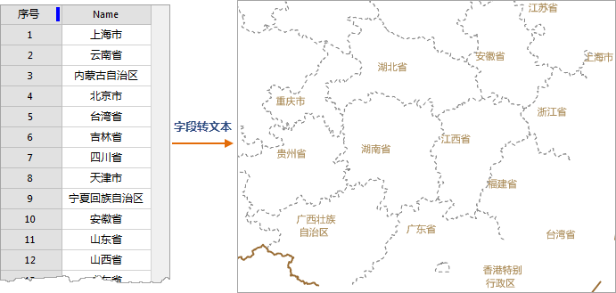
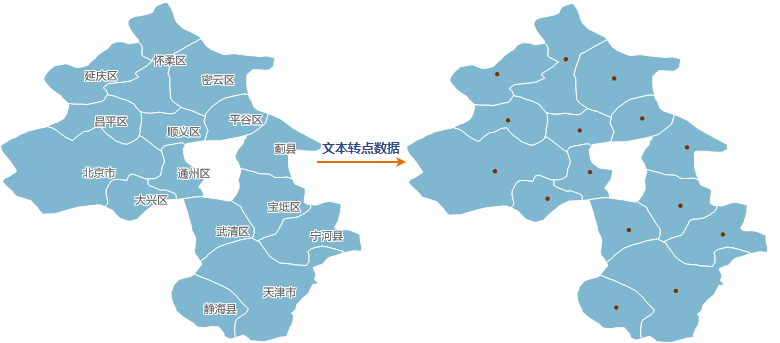
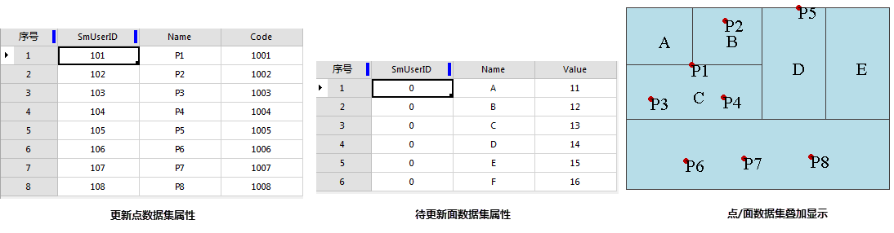
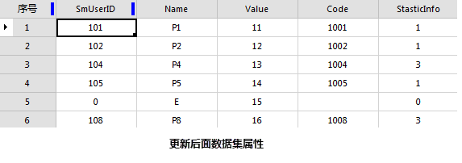

### 文本数据转字段

将文本数据集中的文本信息添加到它的属性表中，需要指定转换后文本信息保存的字段。

**功能入口**

* 单击 **数据** 选项卡-> **数据处理** 组-> **类型转换** 按钮，在弹出的菜单中选择“文本数据->字段”。
* **工具箱** -> **类型转换** -> **属性数据与空间数据互转** 工具：文本数据->字段。(iDesktopX) 

**操作说明**

1. 在弹出“文本数据->字段”对话框中，在文本数据集区域选择待转换的文本数据集，及其所在的数据源。
2. 在待操作字段区域设置要操作的字段。有两种方式: 
  * **现有字段：** 将文本信息保存文本数据集中已有的字段（非系统字段）中，进行转换操作后会覆盖原字段的内容；
  * **新建字段：** 在新建字段文本框中输入新建字段的名称，则进行转换操作后会将文本数据集的文本信息保存到新建的字段当中。用户新建的字段命名必须符合规范。有关字段和数据集的命名规范，请参见[数据库的保留关键字列表](../DataManagement/DatabaseKeyWords.html)。
3. 设置完成后，即可执行转换操作。

### 字段转文本

* 把数据集中的某个字段内容，转变到文本数据集，通过此功能可以实现地图标注。例如我们可以将 China 数据源下 Province_R 数据集的 Name 字段转换为文本数据，将此文本数据和 Province_R 数据集在同一窗口中显示，以实现对 Province_R 数据集的标注。
* 字段到文本后的文本位置由其所对应对象的内点所确定的。如果转换后文本的位置不理想，可以通过改变文本对象对齐方式的方法进行调整。
* 适用于点、线、面、文本、三维点、三维线、三维面、二维网络数据、三维网络数据集以及模型数据集。

**功能入口**

* 单击 **数据** 选项卡-> **数据处理** 组-> **类型转换** 按钮，在弹出的菜单中选择“字段->文本”。
* **工具箱** -> **类型转换** -> **属性数据与空间数据互转** 工具：字段->文本。(iDesktopX) 

**操作说明**

1. 在弹出的“字段->文本数据”对话框中，在列表框区域列出了选中的数据集。设置转换后数据集要保存的数据源、数据集名称以及要转出的字段。
2. 如要将多个数据集的字段转为文本数据，可单击“添加”按钮，添加多个数据集，然后通过“全选”按钮，对其进行统一设置。
3. 设置完成后，即可执行转换操作。
  
---  

### 文本数据转为点数据

将文本对象的锚点提取出来生成新的点数据集。锚点跟文本的对齐方式有关。文本的锚点，即文本的对齐基点，可以是文本的左上角、左下角等。文本的锚点位置可以在 “
**风格设置** ”选项卡“ **文本风格**
”组中，通过对齐方式设置。具体请参见：[设置文本对象的风格](../../Layout/SettingStyle/TextStylegroup.html)。

**功能入口**

* 单击 **数据** 选项卡-> **数据处理** 组-> **类型转换** 按钮，在弹出的菜单中选择“文本->点”。
* **工具箱** -> **类型转换** -> **属性数据与空间数据互转** 工具：文本数据->点数据。(iDesktopX) 

**操作说明**

1. 弹出“文本数据->点数据”对话框，在对话框中设置待转换的数据集，及结果数据集名称和所存的数据源。
2. 设置完成后，即可执行转换操作。
  
---  

### 属性数据转为点数据

将属性表中的字段值指定为 X、Y 坐标值并据此创建相对应的点对象，从而生成一个或多个点数据集。

**功能入口**

* 单击 **数据** 选项卡-> **数据处理** 组-> **类型转换** 按钮，在弹出的菜单中选择“属性->点”。
* **工具箱** -> **类型转换** -> **属性数据与空间数据互转** 工具：属性->点数据。(iDesktopX) 

**操作说明**

1. 弹出“属性->点数据”对话框，在对话框中设置待转换的文本数据集，及结果数据集名称和所存的数据源。。
2. 选择 X、Y 坐标字段，各字段的值为生成的点数据集中相应点的 X、Y 坐标值。
3. 设置完成后，即可执行转换操作。

### 点属性转为面属性

点属性转为面属性是指把点数据属性中的非系统字段值更新到对应面数据的属性中。该功能是将面对象中的点属性更新到面属性中，若一个面内包含了多个点，则会从其中随机选择一个点，将其属性更新到所在的面对象中，同时会增加一个“StasticInfo”统计字段，用于统计每个面对象中包含的点个数。

* 转换的内容包括点属性中的 SmUserID 和所有非系统字段的属性信息。
* 若面属性字段与点属性字段的名称和类型都相同，则点属性字段值会直接更新到面属性字段中；若面属性字段与点属性字段类型不一致或无同名字段，则会在面属性中新建一个同名同类型的字段，再将点属性字段值更新至面属性字段中。

**功能入口**

* 单击 **数据** 选项卡-> **数据处理** 组-> **类型转换** 按钮，在弹出的菜单中选择“点属性->面属性”。
* **工具箱** -> **类型转换** -> **属性数据与空间数据互转** 工具：点属性->面书属性。(iDesktopX) 

**操作说明**

1. 在弹出的“点属性->面属性”对话框中，在对话框中设置待转换的数据集，及结果数据集名称和所存的数据源。
2. 设置完成后，即可执行转换操作。
  
---  
3. 从点数据集、面数据集的属性表可看出： 
  * 点数据集和面数据集有 SmUserID、Name 两个相同字段；
  * 点数据集有一个单独字段 Code，面数据集有一个单独字段 Value；
  * 点数据集和面数据集的相同字段值不相同。

更新后得到如下结果：    
---  
  * 增加了一个来源于点数据集的字段 Code 和一个系统生成的记录字段 StaticInfo；
  * 面数据集的原有单独字段 Value 值没有变化；
  * StaticInfo 字段值与面中更新点的数目相同；
  * 面A、B、C、D、F属性被点 P1、P2、P4、P5、P8 更新，SmUserID 和 Name 值均更新为对应点对象的属性值。

