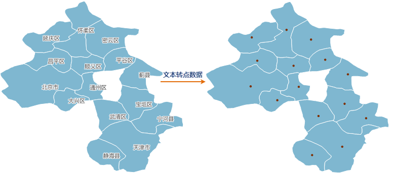

### 使用说明

将文本对象的锚点提取出来生成新的点数据集。锚点跟文本的对齐方式有关。文本的锚点，即文本的对齐基点，可以是文本的左上角、左下角等。文本的锚点位置可以在 “
**风格设置** ”选项卡“ **文本风格**
”组中，通过对齐方式设置。具体请参见：[设置文本对象的风格](../../Layout/SettingStyle/TextStylegroup)。

### 操作步骤

  1. 在“ **数据** ”选项卡的“ **数据处理** ”组中，单击“ **类型转换** ”按钮的下拉箭头，在弹出的菜单中选择“文本数据->点数据”命令。
  2. 弹出“文本数据->点数据”对话框，在对话框中设置待转换的数据集，及结果数据集名称和所存的数据源。
  3. 单击“转换”按钮，完成操作。
  
---  

