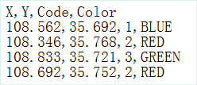
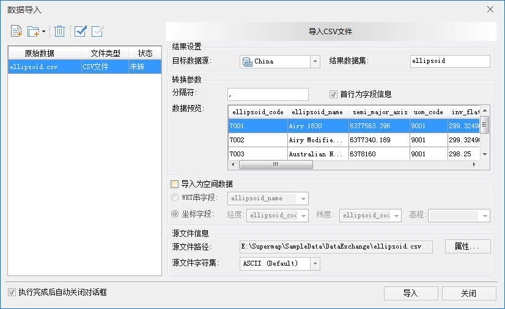
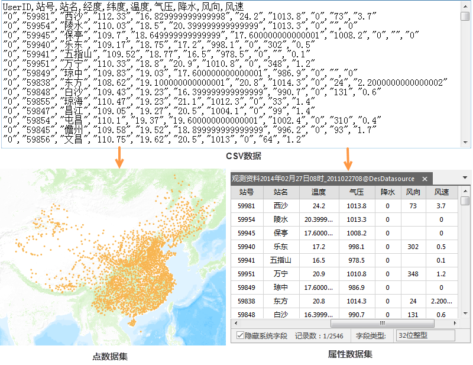

CSV（即 Comma Separate Values）是以文本形式记录数据的文件（通常以逗号为分隔符），这种格式经常用来作为不同程序之间的数据交互的格式。

用户可以通过 Excel 工具将*.xlsx,*.xls,*.xml等格式的属性数据转化成 *.csv
格式数据，进而实现将纯属性数据及属性表形式的其他数据导入 。

同时支持导入满足 csv 格式规范的 txt(*.txt)格式的属性数据，用户无需再进行数据转换即可直接导入。

### 使用说明

具体文件格式需要注意以下几点问题：

  * 开头不能留空，且以行为单位，每条记录是一行。
  * 文本中只能包含分隔符及字段值等信息。
  * 默认以英文逗号作为分隔符， 也支持自定义文本分隔符。
  * 第一条记录可以是字段名。

### 操作步骤

  1. 如下图所示，要导入的 *.csv 文件内容如下：    
以上数据以英文逗号（“,”）作为分隔符，首行为数据的字段信息。共包含了四列属性数据，每一列的含义分别是：X 坐标值，Y 坐标值，类型编码和颜色。
  2. 在“ **开始** ”选项卡的“ **数据处理** ”组中，单击“ **数据导入** ”按钮，或在工作空间管理器中选中需导入到的数据源 ，单击鼠标右键选择“导入数据集...”菜单，在“数据导入”对话框中，添加要导入的 *.csv 格式文件，添加方式请参见[导入数据](ImportData)介绍。
  3. 此时原始文件已经添加到“数据导入”对话框的列表框中，对话框右侧区域显示了导入 CSV 文件需要设置的参数，如下图所示。    
    * **结果设置**
      * 目标数据源：选择导入的文件要存放在的数据源。
      * 结果数据集：输入导入后结果数据集的名称。默认使用原始数据的名称，用户可以不设置。
    * **参数转换**
      * 分隔符：用来设置 CSV 文件中的分隔符，默认使用半角逗号（,）。另外可选的分隔符还有点（.）、制表符（Tab）、空格。系统也支持用户自定义一个文本可识别的字符（包括汉字）。
      * 首行为字段信息：设置需要导入的原 CSV 文件的首行是否是字段名称。勾选该参数，则导入后的字段名称为首行的字段值，否则为属性信息。如果 CSV 文件首行指定了字段信息，则应用程序会自动读取。
      * 数据预览：可预览CSV文件导入为属性表数据的效果。
    * **导入为空间数据**
      * WKT串字段：通过指定WKT串字段方式获取数据的空间信息。
      * 坐标字段：通过设置经度、纬度、高程字段来指定CSV数据对应的空间信息。
    * **源文件信息**
      * 源文件字符集：用来选择原始数据的字符集类型。应用程序支持的字符集列表，请参见[字符集列表](../DataManagement/Charset)。
      * 源文件路径：用来显示原始数据所在的路径，方便用户查看。
  4. 设置完成后，单击“导入”按钮，执行导入 CSV 文件的操作。导入为属性表的结果如下图所示：    

###  注意事项

  1. 在用记事本等文本编辑工具编辑 CSV 文件时，若列内容中存在半角特殊字符（逗号、换行符或双引号），需使用半角双引号对字段值进行转义。若列内容中存在半角引号（即"），则应替换为半角双引号("")转义，并用半角引号将字符串包含起来。如导入后字段值需为：Venture"Extended Edition"，则 CSV 文件中应写成："Venture""Extended Edition"""；导入后字段值为："Supermap"，则 CSV 文件中可写成：""Supermap""或者"""Supermap"""。
  2. 在用 Microsoft Excel 工具编辑 CSV 文件时，字段内容存在特殊字符时，不需要添加转义符进行转码，Excel 在保存 CSV 文件时，会自动对单元格中的特殊字符进行转义处理。

