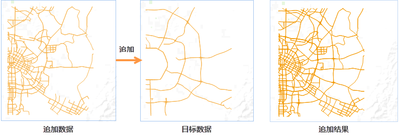

可以通过导入同名的数据集，实现矢量数据集的追加。如果导入的数据与已存在的数据集名称相同，并且数据类型和结构完全一致，在导入过程中会自动完成数据集的追加。

### 使用说明

如以导入同名数据集的方式完成数据的追加，需要注意以下问题：

  * 追加和被追加的数据集必须同名。
  * 追加和被追加的数据集的属性表结构必须完成一致，即属性字段个数、属性字段名称和属性字段的类型必须保持完全一致。
  * 追加和被追加的数据集的投影信息必须保持完全一致。
  * 通过导入数据实现数据追加，只适用于矢量数据集。追加完成后，会将新数据集中记录添加到已导入的同名数据集中。
  * 在导入栅格数据时实现追加，实际上是栅格更新的过程，即将要导入的栅格/影像数据中，与已导入的同名栅格或者影像的重叠区域更新。

### 操作步骤

  1. 在“ **开始** ”选项卡的“ **数据处理** ”组中，单击“ **数据导入** ”按钮，在“数据导入”对话框中，添加要导入的两个或者多个同名数据集。
  2. 添加完成后，同时选中要导入的同名数据集，矢量文件参数设置区中，设置 **导入模式** 为“追加”。 

导入数据时，导入模式提供了数据集名称存在冲突的情况下，数据导入的操作模式。

    

  3. 导入完成后，数据源结点下，只会产生一个数据集。将该数据集添加到地图窗口中查看，发现该数据为导入前多个同名数据集拼接后的结果。
