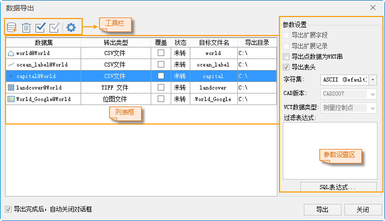
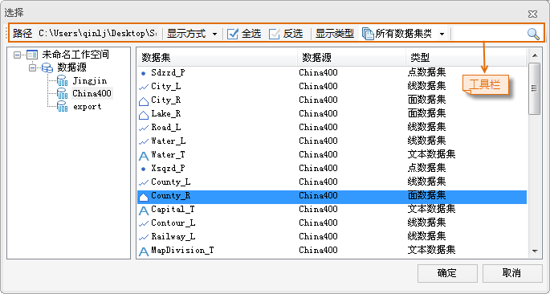

### 使用说明

数据导出应用程序提供了20种数据格式的导出功能。关于支持的导出格式请查看[类型转换支持的数据格式](GeoFormates)中
**数据导出支持的数据格式** 。

### 功能入口

* 单击 **开始** 选项卡-> **数据处理** -> **导出数据** 按钮；
* **选中** 数据集或数据源->单击鼠标 **右键** -> **导出数据** 选项。

### 操作步骤

1. 在“ **开始** ”选项卡的“ **数据处理** ”组中，单击“ **数据导出** ”按钮，或在某数据源或数据集结点处单击鼠标右键，选择“导出数据集...”，即可弹出“数据导出”对话框，如下图所示。
  
---  
2. 单击  按钮，或双击左侧的列表框，在弹出的“选择”对话框的左侧列出了当前工作空间的所有数据源，对话框的右侧列表中列出了选中数据源中的所有数据集的名称和类型。用户可选中一个或多个数据集，单击“确定”按钮即可将当前工作空间中需要导出的文件添加到数据列表中。
  
---  

在“选择”对话框的工具条中组织了几个功能控件，便于用户浏览和选择各数据源中的数据集。

工具栏说明

  * **路径：** 左侧的文本框中显示了选中数据源的绝对路径，若用户在左侧的数据源列表中选中了多个数据源，则在“路径”文本框中显示为最后选中的数据源的路径信息。
  * **显示方式：** 单击“显示方式”标签右侧的下拉按钮，在下拉菜单中提供了详细、列表、大图标、小图标4种数据集显示方式供用户选择。
  * **编辑：** 位于“显示方式”标签的右侧，提供全选、反选两种选择方式；辅助键盘上的 Shift 键和 Ctrl 键，可快速选择所需导出的数据集。
  * **显示类型：** 单击“显示类型”标签右侧的下拉按钮，在下拉菜单中提供了所有数据集类型、所有支持类型、复合数据集、栅格数据集、影像数据集、线数据集、点数据集、面数据集和文本数据集等9种数据集显示类型，用户选择某种类型后，在“选择”对话框右侧的数据集列表中，会过滤显示指定类型的数据集，暂时隐藏其它类型的数据集。系统默认为显示所有支持类型，即显示当前转出类型所支持的的所有数据集类型。
  * **搜索：** 在工具条右侧的搜索框中，用户可输入数据集名称中的全部或部分字符，即可搜索出当前选中数据源中包含这些字符的数据集。

3. 所有添加的数据都会显示在“数据导出”对话框左侧的列表框中，用户可以辅助列表框上方的工具条进行添加、移除数据集或统一修改导出数据集的属性。

工具条按钮说明

  *  按钮：添加文件。 
  *  按钮：移除已添加的文件。
  *  按钮：全部选中列表框中的所有文件。 
  *  按钮：反选列表框中的文件。 
  *  按钮：选中列表框中一个或多个数据集，单击该按钮，弹出“统一赋值”对话框，用户可对选中的数据集设置相同的导出类型、导出目录、是否都覆盖已有文件。

列表框说明

  * **数据集：** 显示了需要导出的数据集的名称。
  * **转出类型：** 若在“选择”对话框中选择的数据集类型与“数据导出”下拉按钮的下拉列表中选中的数据导出格式一致，则“转出类型”项默认显示为这种数据导出类型，用户也可以单击“转出类型”项的下拉按钮，在下拉列表中选择其它数据导出格式；若在“选择”对话框中选择了其它类型的数据集，则转出类型默认为空，用户可在“转出类型”项的下拉列表中选择所需的数据导出格式。
  * **覆盖：** 该复选框用于设置若导出目录下已存在同名文件，覆盖或不覆盖已有同名数据集。若勾选该复选框，则覆盖已有同名文件；若不勾选该复选框，则不导出该文件。
  * **状态：** 数据未导出前，“状态”项显示为“未转”；若数据成功导出，则显示为“成功”；若数据未成功导出，则显示为“失败”。
  * **目标文件名：** 导出文件名默认与原文件名相同，用户也可以对导出文件名重命名：选中需要重命名的数据集，单击“目标文件名”项或键盘 F2 键，目标文件名变为可编辑状态，即可输入新的文件名称，作为导出后的文件名称。
  * **导出目录：** 该项显示了数据导出的默认路径，用户也可以重新指定数据集的导出目录：选中要修改导出目录的数据集，双击“导出目录”项，即可在弹出的“浏览文件夹”窗口中，重新指定数据集的导出目录。

4. 用户可选中列表框中的一个或多个文件，在“数据导出”对话框右侧的参数设置区域，设置导出数据的各个参数。选中不同类型的数据集右侧参数设置区域中可设置的参数项有所区别。

**导出矢量数据集** ：

  * **导出扩展字段：** 该复选框用于显示或设置是否导出 AutoCAD 文件的扩展字段。
  * **导出扩展记录：** 该复选框用于显示或设置是否导出 AutoCAD 文件的扩展记录。
  * **导出点数据为WKT串：** 该复选框用于显示或设置是否导出点数据为WKT串字段。
  * **导出表头：** 该复选框用于显示或设置是否导出文件的表头信息。
  * **字符集** ：导出数据集使用的字符编码方式。为了保证数据集能正确显示，需要使用适合的字符集。导出时，默认使用 ASCII（Default）字符集。最常用的 ASCII 字符集多用于显示罗马数字和字母，GB2312 用于显示简体中文字符，而为了满足跨语言跨平台计算机显示的需要，会使用 Unicode 字符集。应用程序支持的字符集列表，请参见[字符集列表](../DataManagement/Charset)。
  * **CAD 版本：** 该标签右侧的下拉列表中可选择导出的 AutoCAD DWG 文件（*.dwg）或 AutoCAD DXF 文件（*.dxf）的版本号，目前提供 AutoCAD R12、AutoCAD R13、AutoCAD R14、AutoCAD 2000、AutoCAD 2004、AutoCAD 2007。默认导出版本为 AutoCAD 2007。
  * **VCT 数据类型：** 当转出类型选择“中国标准矢量交换格式”，该选框可用，在标签右侧的下拉列表中选择数据图层类型。目前提供测量控制点、数字正摄影像图纠正点、行政区等28种类型，默认导出类型为测量控制点。
  * **SQL表达式** ：可通过设置过滤表达式，过滤掉不需要导出的对象，使满足条件的对象不参与导出，关于如何使用SQL表达式，请参阅[SQL表达式](../../Query/SQLDia)。

**导出栅格、影像数据集** ：

  * **压缩率(%)：** 该项用于显示或设置影像文件的压缩率。默认压缩率为75%。只有当导出文件格式为 JPG 文件(*.jpg)时，该项为可用状态。 
  * **坐标参考文件：** 单击  ，弹出“打开”对话框，即可为当前选中的栅格数据集设置数据集导出的影像数据坐标参考文件的路径。只有当导出文件格式为 JPG 文件（*.jpg）、PNG 文件（*.png）、位图文件（*.bmp）和 GIF 文件（*.gif）时，该项为可用状态。
  * **仿射信息导出为 tfw 文件** :该复选框用于显示或设置是否将仿射转换（图像坐标和地理坐标的映射）的信息导出到外部文件。只有当导出文件格式为 Tiff（*.tif）格式时，该复选框为可用状态。默认为勾选该复选框，即将仿射信息导出到外部的 tfw 文件中，否则投影信息会导出到 Tiff 文件中。
  * **按块导出** ：该复选框用于显示或设置是否将当前栅格、影像数据按照块存储的形式导出。只有当导出文件格式为 Tiff（*.tif）格式时，该复选框为可用状态。
  * **密码** ：当数据集导出为 SIT 影像数据时，可为 SIT 影像数据设置密码进行加密，保证数据安全。
  * **密码确认** ：对设置的密码进行确认，必须与上面的密码设置一致。如果两处输入密码不一致，则在确认密码处会提示：“密码不一致，请重新输入！”的信息。

**注意** ：对 SIT
影像数据设置密码后，在使用该数据时都需要输入密码，例如：导入该数据、以数据源方式打开SIT数据、以影像缓存方式添加该数据至场景、将该数据生成缓存等情况。

5. 用户可通过“数据导出”对话框底部的“导出结束后，自动关闭对话框”复选框，控制当数据导出结束时，是否自动关闭对话框。
6. 单击“导出”按钮，系统将批量导出列表框中的所有数据集。“导出进度”窗口中会显示批量导出列表框中所有数据导出的总进度，及当前正在导出的单个数据的导出进度。

### 备注

1. 当前工作空间中的数据源若都是图像数据引擎，则导出按钮显示为灰色，为不可用状态。
2. 若当前工作空间中存在图像数据引擎，则在“数据导出”窗口中单击“添加”按钮，图像数据引擎会出现在“选择”对话框左侧的数据源列表中，但无法添加该数据源下的图像数据集。
3. 导出 KML 和 KMZ 格式的数据集时要求其投影必须是 WGS_1984 地理坐标系，否则会导出失败。
4. 当矢量导出为vct文件时，必须设置vct对应的图层类型，否则会导出失败。
5. 导入导出电信栅格数据的时候，需要注意以下三点： 
  * 电信栅格格式只支持 Grid 类型的数据集导入导出。
  * 电信栅格格式只支持像素位深为16 的栅格数据的导入和导出。当导出数据为像素位深低于16的 Grid 数据集时，会自动进行像素位深转换，统一转换为16位。
  * 电信栅格格式只支持导入导出分辨率为整型的 Grid 数据集，并且要求 X 和 Y 分辨率必须相等。
6. 将数据集属性表导出为 Microsoft Excel 文件时，目前仅支持一次性导出小于等于10万条记录集。如果数据集记录数为0，则导出失败。
7. 使用的第三方TIF库，目前支持导出为TIFF影像的最大数据量为 4G。若导出数据超过4G，建议用户将数据分块裁剪导出，或以 SIT 影像数据形式导出。

