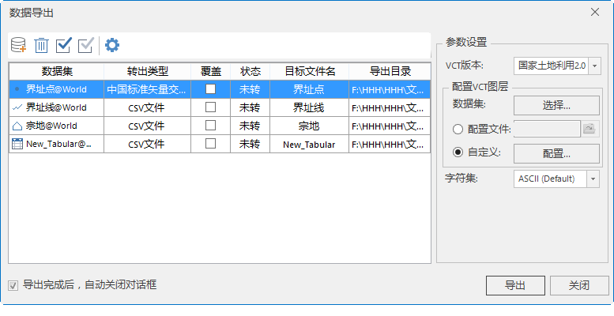
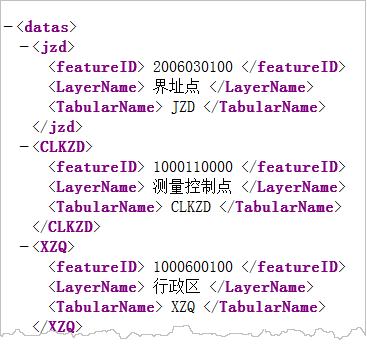
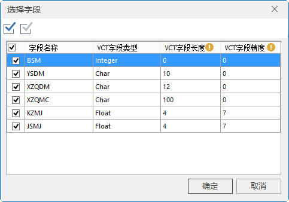
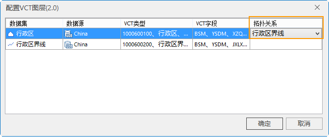
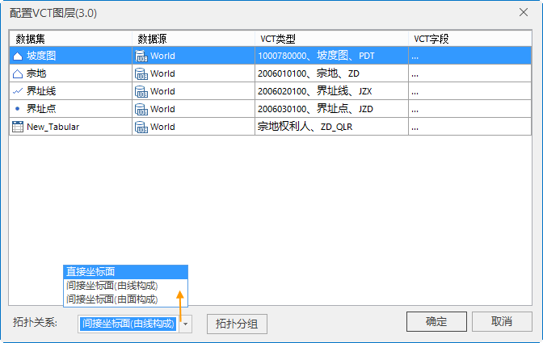

### 使用说明

国土资源部在国家标准《地理空间数据交换格式》（GB/T17798-2007）基础上制定了土地利用数据交换格式，土地利用数据仅描述矢量数据，文件的后缀名为VCT，简称为
VCT
文件，通过该文件来实现各类国土资源空间信息的交换。VCT矢量数据交换格式广泛应用于国土资源部门土地利用现状调查成果汇交、土地利用规划成果汇交和地籍调查数据库成果交换。关于
VCT 参数的具体描述，请参见 [VCT 文件](VCTConfig)页面。

应用程序支持将点、线、面、文本数据集、属性表导出为 VCT 文件。

  * 支持导出为三个版本的 VCT 数据，分别是国家自然标准1.0（简称VCT1.0），国家土地利用2.0（简称VCT2.0），以及国家土地利用3.0（简称VCT3.0）。
  * 支持将多个数据集导出为一个VCT文件。
  * 支持通过导入已有的配置图层类型的.xml文件导出为 VCT 文件。

### 操作步骤

  1. 打开需要转出的数据源，在“ **开始** ”选项卡的“ **数据处理** ”组中，单击“ **数据导出** ”按钮，或在工作空间管理器中选中需导出的数据集，单击鼠标右键选择“导出数据集...”菜单，弹出“数据导出”对话框。
  2. 将需要导出的数据集的”转出类型“选择下拉框中的”中国标准矢量交换格式“，对话右侧区域显示了导出 VCT 文件需要设置的参数，如下图所示。    
---  
  3. **设置 VCT 版本** ：选择 VCT 导出版本。程序提供国家自然标准1.0，国家土地利用2.0，以及国家土地利用3.0版本供用户选择。
  4. **配置VCT图层** ：选择不同的 VCT 版本，需要配置的参数略有不同： 
    * **选择导出数据集** ： 单击  按钮，弹出”选择数据集"对话框，通过单击工具栏  的添加按钮，加载该数据源下的多个数据集，支持选择多个数据集文件导出至一个VCT文件中。
    * 可通过“导入配置文件”和“自定义”两种方式配置 VCT 图层： 
      * **导入配置文件** ：导入用户已有的配置文件对导出数据集进行配置。
      * **自定义配置** ：单击  按钮，弹出”配置 VCT 图层"对话框,根据用户选择的导出的 VCT 版本，需要配置的信息有所不同，以下分开进行表述.
  5. 当选择的导出版本为 **国家自然标准1.0** 时，弹出“配置 VCT 图层（1.0）”对话框：

  * 数据集、数据源中显示导出数据集的图层名称及所属数据源。
  * **VCT 类型** ：设置导出数据集转出后的VCT类型。目前，程序预设了界址点、测量控制点、行政区等47种VCT转出类型。用户可点击VCT类型下拉按钮，为每个数据集选择转出后的类型。

**注** ：如若预设字段不满足用户的转出类型需求，支持用户自己设置图层配置文件。图层类型配置文件存放于：安装路径：SuperMap iDesktop
.NET 10i\Templates\Conversion 文件夹下的 vctDataType.xml文件中。

图层类型配置

  * 打开图层配置文件 vctDataType.xml，如下图所示：一个图层类型包含三部分：FeatureID（要素代码）、LayerName（要素名称）、TabularName（属性表名）。例如：界址点图层的要素编码为”2006030100“，”界址点“即为要素名称，属性表名为”JZD“。    

  * 用户可参照如上规则配置图层类型文件，保存修改后的文件，重新启动桌面，即可在VCT类型下选择新增的图层类型。

  * **VCT 字段** : VCT 类型设置完成，双击该数据集VCT字段文本框，弹出“选择字段”对话框，对导出字段进行设置，选择该数据集中需要导出的字段，勾选对应字段名称前的复选框，并对字段类型、长度及精度进行修改。如下图所示：    
---  
  * **字段名称** ：数据集转出字段名称。
  * **VCT 字段类型** ：单击该字段的VCT 字段类型，可在下拉菜单中选择 Char、Integer、Float、Data、Time、Varbin等五种类型。
  * **VCT 字段长度** ：设置所选字段类型的字段长度。当值设置为0或空时，表示不定义该vct字段的长度。
  * **VCT 字段精度** ：设置所选字段类型的字段精度。当值设置为0或空时，表示不定义该vct字段的精度。 
  6. 当选择的导出版本为 **国家土地利用2.0** 时，弹出“配置 VCT 图层（2.0）”对话框,其中 VCT 类型和 VCT 字段的设置同 国家自然资源1.0的设置，在此版本中支持为面图层设置拓扑关系：
  
---  
  * **拓扑关系** ：配置与导出面数据集存在拓扑关系的线数据集。如果在此指定了某一面数据集与线数据集之间的拓扑关系，则须将该线数据集和面数据集同时导出至改VCT文件。例如设置面数据集“行政区”与线数据集“行政区界线”建立拓扑关系，则导出VCT文件中必须包含数据集“行政区”及“行政区界线”。
    * 建立拓扑关系后得到的VCT文件中，把“行政区”拆分得到的系列线ID，存储在VCT的“LineBegin/LineEnd”中。线ID对应的要素代码，用线的要素代码。
    * 未建立拓扑关系得到的VCT文件中，把“行政区”拆分得到的系列线ID，存储在VCT的“LineBegin/LineEnd”中。线ID对应的要素代码，用面的要素代码。
  
  7. 当选择的导出版本为 **国家土地利用3.0** 时，弹出“配置 VCT 图层（3.0）”对话框,其中 VCT 类型和 VCT 字段的设置同国家自然资源1.0的设置，在此版本中支持选择设置拓扑关系，拓扑关系包括：直接坐标面、间接坐标面（由线构成）、间接坐标面（由面构成）可供用户选择。
  
  8. **字符集** ：导出数据集使用的字符编码方式。为了保证数据集能正确显示，需要使用适合的字符集。导出时，默认使用 ASCII（Default）字符集。最常用的 ASCII 字符集多用于显示罗马数字和字母，GB2312 用于显示简体中文字符，而为了满足跨语言跨平台计算机显示的需要，会使用 Unicode 字符集。应用程序支持的字符集列表，请参见[字符集列表](../DataManagement/Charset)。
  9. 依次对转出数据的VCT类型、VCT字段进行设置，设置完成后，单击“确定”按钮，退出当前数据集设置窗口，在数据导出对话框中单击”导出“按钮，执行导出VCT文件的操作。

