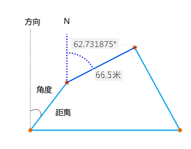
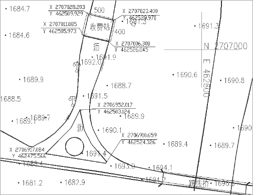
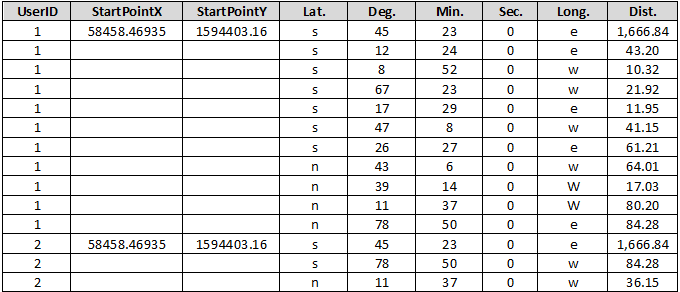
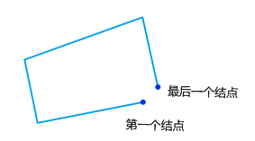
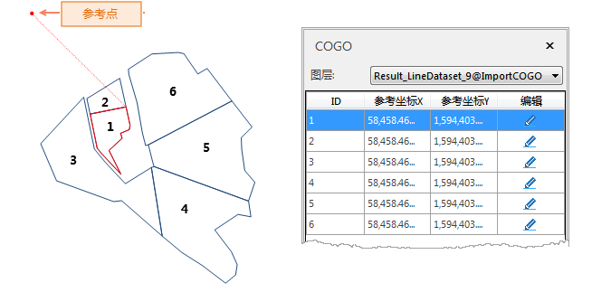

---
id: ImportCOGO
title: 导入 COGO 文件  
---  
### 功能说明

COGO, 为坐标几何 Coordinate Geometry 缩写，COGO
文件是按照测量的方向、角度、距离来记录坐标点之间的相关关系，通过一系列的坐标点描述几何对象。

 

  
常用于测量或工程设计图中，通过仪器测量点位之间的相对方位和距离，从而描述地理要素之间的相对位置关系。例如，下方显示的测量图利用角度、距离对收费站的边界线进行描述，并通过角度确定道路与收费站的相对位置。

  

  
SuperMap 桌面提供的导入 COGO 文件功能是将按照特定格式记录在 Excel 表格文件中的一系列坐标几何点数据，导入成为空间线数据集，实现属性信息快速入库生成空间数据，从而在地图中直观描述和定位几何对象。

**COGO 所需字段**

导入的 COGO 文件需按照特定的格式组织对象信息，其中每个对象均需指定参考点，参考点是每个 COGO 对象的唯一标识，程序会根据参考点及 COGO
对象第一个点位的方向及角度值绘制位置，第二个点的位置再以第一个点为参考，以此类推，依次遍历对象中的每一个点，从而得到一个完整的 COGO 对象。COGO
文件必须包含以下字段信息：

字段名 | 描述 | 备注  
---|---|---  
**UserID** | 线对象序号，一个线对象中包含的所有点 UeserID 相同。例如，当前线对象1包含11个坐标点，则11个点的 UserID均为“1”。 | 必填  
**StartPointX** | 参考点 X 坐标，作为COGO对象的标识基准点 X 坐标。  | 必填  
**StartPointY** | 参考点 Y 坐标，作为COGO对象的标识基准点 Y 坐标。  | 必填  
**Lat.** | 基于参考点的南北方向。 | 必填  
**Deg.** |  以度分秒形式显示坐标点的角度值，度、分、秒单独填写，此处为度（°）。 | 必填  
**Min.** | 以度分秒形式显示坐标点的角度值，度、分、秒单独填写，此处为分（′）。 | 必填  
**Sec.** | 以度分秒形式显示坐标点的角度值，度、分、秒单独填写，此处为秒（″）。 | 必填  
**Long.** | 基于参考点的东西方向 | 必填  
**Dist** | 线要素两个坐标点之间的距离。  | 必填  
  
下图为 COGO 文件的示例，文件中包含两个 COGO 对象，其中对象1包含11个点对象，对象2包含3个点对象，UserID
分别为1、2；StartPointX、StartPointY 为每个对象参考点的 X、Y 坐标值；Lat.及Long.为基于参考点的两个方向；Deg.
Min. Sec. (度、分、秒)，即角度值。第一个点基于参考点绘制，第二个点将基于第一个点绘制，程序会依次遍历每个点的坐标和方位，从而生成线要素对象。

  
###  导入COGO 文件

### 功能入口

单击 **开始** 选项卡-> **数据导入** 下拉菜单中-> **导入 COGO 文件** 按钮。

### 参数说明

  * **目标数据** ：选择导入的文件要存放在的数据源及数据集名称。
  * **源数据路径** ：选择待导入的 COGO 文件。
  * **闭合对象** ：勾选此复选框，程序会自动连接线对象的第一个节点和最后一个结点，形成一个封闭的对象。如下图1、图2为设置闭合的对比图，图2为勾选闭合对象后，第一个结点和最后一个结点自动连接，形成闭合对象。
  * **复位最后一个结点** ：在勾选闭合对象复选框后，此选项可用，同时勾选复位最后一个结点，程序会舍弃最后一个结点，将倒数第二个结点作为最后一个结点与第一个结点相连接，形成闭合对象。适用于测图时最后一个点位数据存在偏差，可舍弃最后的一个结点，将其他结点相连接形成闭合对象。  

 

**注** :完成 COGO 文旦导入后，程序会自动打开导入后的线数据集，同时弹出“COGO”对象编辑面板。

### 实例

COGO
文件中有6个对象的坐标及角度信息，导入后得到如下图所示的结果，同时在COGO对象编辑面板中可查看每个COGO对象的参考点，点击某一对象，地图中将高亮显示该对象及其参考点，参考点与对象之间通过红色辅助线作为标识。

 
  
###  COGO 对象编辑

在 COGO 对象编辑面板可查看 COGO 对象的参考点，同时可通过修改参考点的坐标来移动 COGO 对象，可通过两种方式修改参考点坐标：

  * 选择待移动参考点坐标，单击“编辑”按钮，将鼠标移动到地图窗口中，重新指定参考点位置。
  * 手动输入参考坐标X、参考坐标Y的值进行修改。

**注** ：若关闭了COGO对象编辑面板，可在“对象操作”选项卡中“对象编辑”组”的 Gallery
控件中，单击“COGO”按钮，重新调出“COGO”面板。

