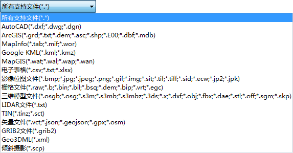

---
id: ImportData
title: 导入数据  
---  
### 使用说明

**数据导入** 按钮提供了所支持的格式的数据导入功能。当前工作空间中存在数据源时，数据导入下拉菜单中的功能才可用。

应用程序提供了60多种数据格式的导入功能，单击 **数据导入** 按钮-> **选择**
对话框->查看应用程序支持导入的数据格式，并且对这些数据格式进行分类分组，使用户可以快速定位到某种数据格式上。关于支持的导入格式请查看[类型转换支持的数据格式](GeoFormates.html)中
**数据导入支持的数据格式** 。

### 操作步骤

1. 在 **开始** -> **数据处理** ->单击 **数据导入** ，弹出 **数据导入** 话框。
2. 单击 **添加** 按钮，或双击左侧的列表框，在弹出的 **打开** 对话框中指定要导入文件所在的位置及文件名，单击 **打开** 按钮即可添加要导入的文件到数据列表中。单击 **所有支持文件(*.*)** 按钮，可筛选显示指定的数据类型。
  
---  
3. 所有添加的数据都会显示在 **数据导入** 对话框左侧的列表框中，用户可以辅助列表框上方的工具条进行添加或移除列表框中的文件。
* **原始数据：** 显示了要导入文件的名称。 
* 显示了导入文件的数据类型，包括矢量文件和栅格文件两种类型。
* **文件类型：** 显示了要导入文件的数据类型。 
* **状态：** 数据未导入前， **状态** 项显示为 **未转** ；若数据成功导入，则显示为 **成功** ；若数据未成功导入，则显示为 **失败** 。 
4. 用户可选中列表框中的一个或多个文件，在 **数据导入** 对话框右侧的参数设置区域，设置导入数据的各个参数。不同类型的数据右侧参数设置区域显示的参数有所区别，这里不一一介绍。有关一些常用的公有参数的说明，请参见[公有参数设置](ParameterSettingDia.html)。
5. 用户可通过 **数据导入** 对话框底部的 **导入结束自动关闭对话框** 复选框，控制当数据导入结束时，是否自动关闭对话框。
6. 单击 **导入** 按钮，系统将批量导入列表框中的所有数据。
* 在数据导入时，会显示 **导入进度** 窗口。 **导入进度** 窗口中既显示了批量导入列表框中所有数据导入的总进度，也显示了当前正在导入的单个数据的导入进度。
* 在数据导入过程中，可单击 **导入进度** 窗口中的 **取消** 按钮，即终止当前导入操作。同时地图窗口会提示 **导入失败** 。

###  备注

1. 目前仅支持导入SketchUp2019版本以下的SKP数据。
2. 每个导入项的默认目标数据源为工作空间管理器中选中的数据源集合的第一个非只读数据源；若用户没有选中工作空间管理器中的任何数据源，则每个导入项的默认目标数据源为数据源集合中的第一个非只读数据源。
3. 若当前工作空间管理器中的所有数据源都是只读的，则导入功能区显示为灰色，为不可用状态。
4. 若用户在列表框中同时选中了多个栅格文件或矢量文件，则 **数据导入** 区域的文件参数设置区域按照最后选中的数据格式显示参数设置项。
5. 若用户在列表框中同时选中了栅格数据和矢量数据，则 **数据导入** 区域的文件参数设置区域仅显示公共参数。
6. 数据导入后，数据集的坐标系默认与所在数据源坐标系一致。
7. 关于导入模式的说明：在导入矢量和栅格数据的时候导入模式结果稍有不同。  

* 强制覆盖模式：两者都是将原有的同名数据集删除，替换为新导入的数据。
* 追加模式：对矢量数据集而言，追加是直接将要导入的数据添加到已存在的同名数据集中；对栅格或者影像数据集，追加实际上是进行两个同名数据的重合区域的更新。关于数据集的追加的详细说明，请参见[数据集追加](DataAppend.html)。
特别强调，追加模式和强制覆盖模式在存在同名数据集的情况下使用。在实际的操作过程中，请区别使用。
