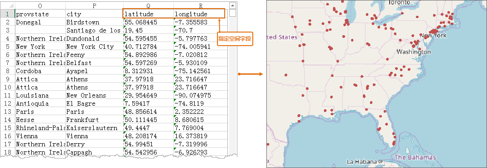

---
id: ImportExcel
title: Excel 文件的导入  
---  
在数据采集时，常常会将地理数据的空间信息保存到 Excel 文件中，可提高现有数据的利用率。  提供了导入 Microsoft Excel
文件为属性表，同时支持指定空间字段导入为空间数据。

具体文件格式需要注意以下几点问题：

* 导入的 Microsoft Excel 文件格式只支持 Office 2007 及以上版本，即 *.xlsx 格式的文件。
* 导入的结果数据集的名称，一般情况下是 “Excel 文件名”+“_”+“sheet名称”。
* 导入 Microsoft Excel 时，默认导入所有有数据的sheet，忽略无数据的sheet。
* 当存在合并单元格时，仅合并单元格区域的第一个单元格有数据。

### 功能入口

* **开始** 选项卡-> **数据处理** -> **数据导入** 。
* 在工作空间管理器中选中需导入到的 **数据源** ->单击鼠标右键-> **导入数据集...** 。
* **工具箱** -> **数据导入** -> **电子表格** -> **导入Excel** 。(iDesktopX)

### 导入Excel

1. 在 **数据导入** 对话框的工具条中，单击“添加文件”按钮 ，添加要导入的 *.xlsx 格式文件，添加方式请参见[导入数据](ImportData)介绍。
2. 结果设置中的目标数据源、结果数据集、编码类型、导入模式，以及源文件信息的参数说明，请参见[数据导入公共参数](ParameterSettingDia)说明页面。
3. **转换参数**
  * **首行为字段信息** ：设置需要导入的源 Excel 文件的首行是否是字段名称。勾选该参数，则导入后的字段名称为首行的字段值，否则为属性信息。如果 Excel 文件首行指定了字段信息，则应用程序会自动读取。
  * **数据预览** ：可预览 Excel 文件导入为属性表数据的效果。 
4. **导入为空间数据**
  * 坐标字段：通过设置经度、纬度、高程字段来指定 Excel 数据对应的空间信息。
5. **属性** ：单击“属性…”按钮，可查看 Excel 文件的属性信息。

* 设置完成后，单击“导入”按钮，执行导入 Excel 文件的操作。导入为空间数据结果如下图所示：    

### 直接打开Excel文件

支持直接打开Excel文件，将其以属性表的形式进行只读查看。具体操作方式如下：

在工作空间管理器中，单击“数据源”节点右键，选择“打开文件型数据源...”项，在弹出的对话框中选择待浏览的 Excel
文件，单击“打开”按钮即可弹出“Excel浏览参数设置”对话框。浏览 Excel 支持浏览前 1000
条记录和浏览全部数据两种方式。若勾选“首行为字段信息”可将Excel表的首行设置为属性表字段名称，单击“确定”之后会将Excel文件转换为属性表数据集，双击打开即可进行浏览。

### 注意事项

1. 若 *.xlsx 文件名以数字开头，且“结果数据集”处使用源文件的名称，则导入成功后的属性表数据集名称为：“Dataset_” + “*.xlsx 文件名”。

