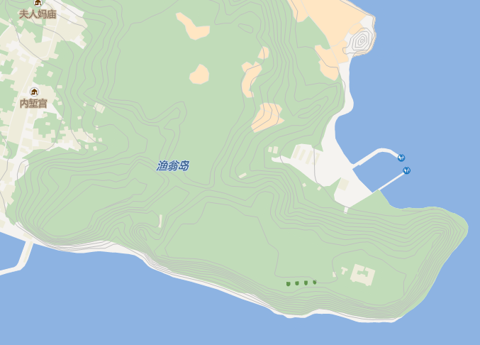

---
id: ImportGJB
title: 导入 GJB 文件  
---  
### 使用说明

GJB 文件是军用数字地图的矢量数据模型文件，通过 ASCII 明码方式保存。军用数字地图矢量数据模型采用矢量形式表示地理空间实体及相互关系。该模型主要分四个层次按树型结构描述，四个层次之间相互关联，具体说明如下：

* 第一层为区域（area），是数据组织的基本单元，也是数据操作和数据应用的基本单元，一个区域中，地图要素的数据描述及拓扑关系是完整的，区域的大小可根据应用需要确定，区域边界可以是规则的或者不规则的。
* 第二层为要素层和注记层，是区域中地理实体的分类组织，也是组成区域的逻辑单元。
* 第三层是要素，分为基本要素、符合要素和注记要素，是组成要素层的基本单元。
* 第四层为基本要素的具体表现形式，分为点状要素、线状要素、面状要素。

SuperMap 支持将 GJB 文件夹中的数据导入为点、线、面、文本及属性表数据集，不能导入为 CAD 数据集。将 GJB
文件导入后，支持通过默认的地图模板生成一幅地图。

### 功能入口

* **开始** 选项卡-> **数据处理** -> **数据导入** 或下拉按钮。
* 在工作空间管理器中选中需导入到的 **数据源** ->单击鼠标右键-> **导入数据集...** 。
* **工具箱** -> **数据导入** -> **导入文件夹** 中的工具： **导入GJB文件夹** 。(iDesktopX)

### 操作步骤

1. 打开或新建一个数据源，从功能入口打开“数据导入”对话框。
2. 在 **数据导入** 对话框的工具条中，单击“添加文件”按钮，选择“ **GJB 文件夹** ”，在“选择文件夹”对话框中设置 GJB 数据所在的文件夹路径，程序会自动遍历该路径下的所有子文件夹。
3. 结果设置中的目标数据源、结果数据集、编码类型、导入模式，以及源文件信息的参数说明，请参见[数据导入公共参数](ParameterSettingDia)说明页面。
4. **结果设置**
* 字体转换文件：在导入 GJB 文件时，支持导入 GJB 数据的字体配置文件。用户可以将字号大小、字体类型、字体颜色的转换关系，预先写到 config 文件中，在此处选择*config 文件导入。以下对*.config配置文件的内容和结构作以描述，用户可参照如下结构配置*config文件。
配置字体转化文件

文件内容包含3部分：字体大小对照，字体对照，字体颜色对照。

  * **字体大小对照** : 如下图所示，其中：”FaceSizeBegin“为字体大小对照开始标志，“280100,280299,5 ”表示GJB文件文本编码为280100至280199的对象采用以下5个对照类型，其后5行逗号前表示GJB中字体大小，逗号之后为对照到SuperMap产品的字体大小，可以添加多组，如其后所列。”FaceSizeEnd“为字体大小对照结束标志.   

```  
FaceSizeBegin   
280100,280299,5  
6,8  
7,8.5  
8,9.5  
9,9.5  
10,10  
280300,280399,3  
12,11  
12,11  
12,11  
FaceSizeEnd  
```
  
* **字体对照** ：如下图所示，其中：”FaceNameBegin“为字体对照开始标志；等线体,方正中等线简体 逗号前表示 GJB 中字体，逗号之后为对照到 SuperMap 产品的字体，可以添加多组，如其后所列。”FaceNameEndn“为字体对照结束标志。 
  
```
FaceNameBegin
等线体,方正中等线简体  
中等线体,方正中等线简体  
FaceNameEnd  
```

  * **字体颜色对照** ：如下图所示，其中：”FaceColorBegin“为字体颜色对照开始标志；黑色,63,63,63,255 黑色表示GJB中字体颜色，其后四个值表示对照到 SuperMap 中的 RGBA 值。”FaceColorEnd“为字体颜色对照结束标志。  

```
FaceColorBegin
黑色,63,63,63,255
兰色,0,160,233,255  
蓝色,0,160,233,255  
白色,255,255,255,255  
无色,0,0,0,1  
FaceColorEnd  
```  

* **创建空间索引** ：勾选该项可按数据集支持的索引类型，对数据集创建空间索引，提高数据的空间查询和访问效率。
5. **结果展示**
* 在地图中展示：勾选该复选框，则会根据SuperMap提供的地图模板，将导入的 GJB 数据制作为一幅地图，并打开至地图中。
6. 设置完成后，单击“导入”按钮，执行导入 GJB 数据文件的操作，导入后的数据在地图中的局部展示如下图：    
---  


